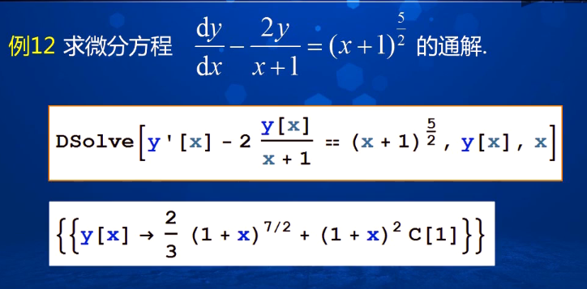

# using method

shift  +  enter    运算
Alt     +  。  结束运算
圆周率 Pi
角度     1Degree
自然常数     E     E表示2.71828
无穷大        Infinity
虚数单位     I(大写的 i ) 用于构造复数，如2 + 3I

## Mathematica 中的函数
单词首字母大写
方括号设置参数
圆括号改变计算顺序

挂尾函数
表达式，或参数 //函数
//Simplify

## 定义函数
函数名写左侧
函数名：以字符开头的常见字符组合
默认约定，区别内部函数名
一般用小写字符开头、后面紧跟方括号

自变量后面加\_ ，多个变量之间用逗号隔开

定义函数后，用分号隔开

## 列表处理 花括号
列表以 "{}" 形式描述，如{1, 2, 4, 8} 表示包含有 4 个元素的列表，也表示向量。
列表中元素的引用通过：
"Part[列表, i]" 或 "列表[[i]]"
表示列表中第 i 个值，也可以给第 i 个元素赋值
列表生成可以通过列举元素方法或者通过
        Table, Array, Range 
    等命令来实现  

## 绘图

1. 平面图形绘图命令
Plot                            显函数绘图
ParametricPlot           参数方程绘图
PolarPlot                    极坐标方程绘图
CountourPlot             隐函数绘图
ListPlot                       绘制点列图

格式：函数 + 方括号 + 函数表达式 + 花括号 参数范围

函数之间的等号 用双等号。
一个等号表示赋值

## 三维图形绘制命令
Plot3D         绘制二元函数对应的空间曲面
ParametricPlot3D    绘制空间曲线、曲面参数方程对应空间曲线与曲面

### 常见图元绘制命令

### 求解方程与不等式

## 求极限
Assumptions          设定参数满足条件
Direction                设定变量变化方向
Analytic                  设定是否以解析式计算

## 求积分
Integrate[f, x]        计算不定积分
Integrate[f, {x,x~min~,x~max~}]        计算定积分
Integrate[f, {x,x~min~, x~max~}, {y, y~min~, y~max~}, ...]        计算重积分

## 解微分
DSolve[eqns, y[x], x]         解常微分
RSovle[eqn, a[n], n]           求通项

## 求解数列通项
RSolve        解递推方程

