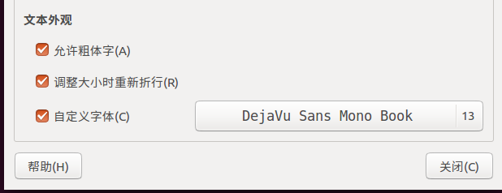

# bash解释器
## 05\. Bash解析器常用快捷键(熟练)

**5.1 Tab键**

*   补齐命令
*   补齐路径
*   显示当前目录下的所有目录

**5.2 清屏**

clear作用为清除终端上的显示(类似于DOS的cls清屏功能)，也可使用快捷键：Ctrl + L ( “L” 为字母 )。

> deng@itcast:~$ clear

**5.3 中断进程**

ctlr+c的作用是中断终端的操作。

> deng@itcast:/$ sleep 3000

**5.4 遍历输入的历史命令**

*   从当前位置向上遍历：ctrl + p （**↑**）
*   从当前位置向下遍历： ctrl + n（**↓**）

**5.5 光标相关操作**

*   光标左移： ctrl + b （**←**）
*   坐标右移： ctrl + f （**→**）
*   移动到头部： ctrl + a（**Home**）
*   移动到尾部： ctlr + e（**End**）

**5.6 字符删除**

*   删除光标前边的字符：ctrl + h（Backspace）
    
*   删除光标后边的字符：ctrl + d
    
    光标后边的字符即光标覆盖的字符
    
*   删除光标前所有内容：ctrl + u
    
*   删除光标后所有内容：ctrl + k

## 06\. Linux系统相关快捷键(了解)

**6.1 图形打开终端方式：(三种方式)**

1）Alt + F2 打开运行输入 gnome-terminal

2） 搜索您的计算机 --> 输入终端 --> 打开

3）右击桌面打开终端

**6.2 终端相关快捷键**

(终端必须选中)

Ctrl + Shift + N 新建一个终端 Ctrl + Shift + T 在终端里新建一个标签 Ctrl + Shift + W 关闭标签页 Ctrl + Shift + Q 关闭窗口

Ctrl + Shift + C 复制 Ctrl + Shift + V 粘贴

Alt + \[1 - 9\] 标签之间切换 Ctrl + Shift + = 放大终端字体 Ctrl + - 缩小终端字体 Ctrl + 0 普通大小 F11 全屏 再次按F11退出全屏 Ctrl + D 关闭当前一个终端 Alt + F4 关闭整个终端 Ctrl + Shift + F 查找

终端字体推荐使用：DejaVu Sans Mono Book

编辑--> 配置文件首选项--> 常规

Alt + Tab 应用程序间切换 Ctrl + Alt + Backspace 注销 Ctrl + Alt + F7 回到图形界面

Ctrl + Alt + F1到 Ctrl + Alt + F6 可以访问6个虚拟控制台