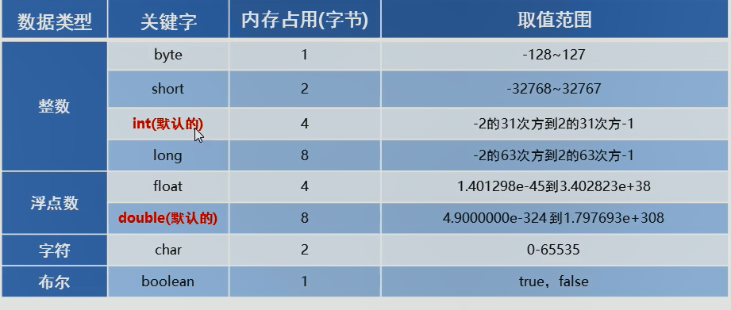

# 2022-03-12

## 数据类型

null 空常量 不能直接打印
true 和 false 可以直接打印，输出为 字符串本身

'' 单引号 字符  ，  单个中文在这里 也被视为单个字符    

### 不同的地方
char 类型在此处 占两个字节大小
boolean 类型
float类型 定义的数值后面 +F
long类型 定义的数值后面 +L

byte 类型 占用 1 字节

### 类型转换
byte、short 、char 类型在运算时，直接转换类型为 int

定义 long 类型的时候，初始化数值默认 是 int 类型
需要在数值后面 加上 L ，才能转换为 long 类型





## 作用域

直接写上 {} 就是一个作用域

### 键盘录入

头文件 import java.util.Scanner;  这里叫导包

创建对象
Scanner sc = new Scanner(System.in);    
类型        标识符       调用函数
即获取 该函数的返回值
这里是个结构体

使用变量接收数据
int i = sc.nextInt();

## 标识符 
下划线 、 $  、 字母、数字


## 运算符

字符串可以通过  +  连接 字符串或其他类型，都转成 字符串类型


## 逻辑运算符 

两边都会执行  ， 我看是叫死路运算符
& 与
| 或

与c语言完全相同，在这里被称作 短路运算符
&& 
||      


！非
^ 异或    ——  同真假 为 假， 异真假 为真


### 单字符的加减 与 c语言一样
转为 ASCII 值，再加减。 类型为int


## 控制语句 除了一点，其他 与 c 语言完全相同

break 语句的用法，借鉴了goto的用法，可以跳出多层循环语句

多了个标号
方法 ： 在想要跳出的循环语句前 加上 标号，然后 break 标号；

```java
lo:while(true){
    Scanner sc = new Scanner(System.in);
    int week = sc.nextInt();
    switch(week){
        case 0:
        break lo;
        default:
        break;
    }
}


```


