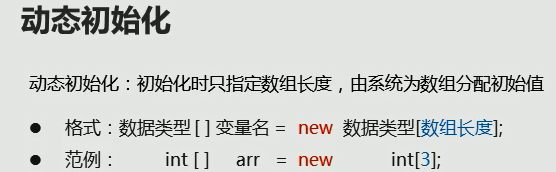

# 2022-03-19

## 数组

### 定义格式
格式一：数据类型[]      变量名

格式二：数据类型        变量名[]

### 初始化
动态初始化

数组创建完毕时，系统默认初始化

格式：类型名[]  = new 数据类型[数组长度]

注意：打印数组变量时，会打印出数组的内存地址

@：分隔符
[  ：数组类型
I  ：数据类型
后面地址

静态初始化：
int[] arr = {1,2,34,5};