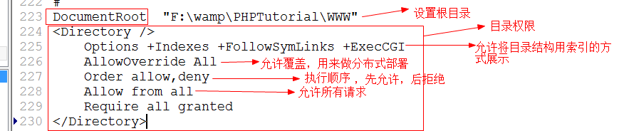

# PHPstuty
## cmd 命令
|      目录       |            命令             |       作用       |
| -------------- | -------------------------- | ---------------- |
| all            | 盘符:                       | 切换盘符         |
| all            | netstat -ano               | 查看端口占用情况  |
| Apache\bin\    | httpd -v                   | 查看Apache版本号 |
| Apache\bin\    | httpd -t                   | 检测运行环境      |
| php\php-7.0... | php -v                     | 查看版本号       |
| all            | netstat -ano \| findstr 80 | finester 80      |

## hosts 文件
目录 windows\System32\drivers\etc\
作用 ：本地DNS
格式：
IP地址           域名   例：www.zhq.com

## Apache 配置文件
### httpd.conf 和 vhosts.conf
* httpd.conf 在手动配置下 是Apache配置的主文件
* vhosts.conf 是自动配置好的，一个导向文件，嵌套在 httpd.conf 文件中
    

* DocumentRoot 目录   指向 访问目录

|                Directory参数                |                                   功能                                    |
| ------------------------------------------ | ------------------------------------------------------------------------ |
| Options + Indexes +FollowSymLinks +ExecCGI | 允许通过域名访问目录      **项目上线以后，应关闭目录结构:删除该命令或+换成-** |
| AllowOverrideAll                           | 允许覆盖，用于分布式部署                                                    |
| Oder allow,deny                            | allow 和 deny 的执行顺序，后执行优先                                        |
| Allow from all                             | 允许所有访问                                                               |
| Deny 192.412                               | 不允许该IP访问                                                             |
| Require all granted                        | 给予所有权限                                                               |

* 


### 更改默认首页 
DirectoryIndex   默认首页文件名
顺序从前往后

### 更改端口
Listen 80
Listen 98
可设置多个端口

cmd 中 netstat -ano 查看端口占用情况

## PHP定界符 
>嵌入式 
```php
<?php
?>
```

>纯PHP代码

```php
<?php
```

>短标记式     ——   注： 需要更改php配置文件 php.ini   将 short_open_tag  改成 on
```php
<?
?>
```
## 虚拟主机配置
需求：配置多台主机
### 一、引入 vhost.conf 配置文件
配置如下：
```cmd
<VirtualHost _default_:80>
    DocumentRoot "C:\web1"    #指定虚拟目录路径
    Servername www.baidu.com  #绑定域名
    DirectoryIndex aa.php     #默认首页
    <Directory "C:\web1">     
        Options -Indexes -FollowSymLinks +ExecCGI
        AllowOverrride All
        Order allow,deny
        Allow from all
        Require all granted
    </Directory>
<
```

```cmd
<VirtualHost _default_:80>
    DocumentRoot "C:\web2"    #指定虚拟目录路径
    Servername www.sina.com  #绑定域名
    DirectoryIndex bb.php     #默认首页
    <Directory "C:\web2">
        Options -Indexes -FollowSymLinks +ExecCGI
        AllowOverrride All
        Order allow,deny
        Allow from all
        Require all granted
    </Directory>
<
```
### 二、在host文件中做dns解析
```
127.0.0.1 www.baidu.com
127.0.0.1 www.sina.com
```


### 总结什么是虚拟主机
站点：放素材的目录
虚拟目录：站点 + 权限
虚拟主机：虚拟目录 + 域名


## php的语言类型
编译型语言：源代码编译的可执行文件保存后再执行；
解释性语言：源代码编译的可执行文件直接执行；

### php执行过程：
词法分析->语法分析->编译(生成opcode代码)->opcode代码保存在内存中->执行

## php输出语句
* echo
* print();  —— 成功返回1
* print_r();  —— 输出数组
* var_dump(); —— 双引号括输出数据，先输出数据类型和长度
    * 例如： string(3)"abc"

## 变量、可变变量、变量传递
* 变量定义 ：$+变量名       相当于一个一级指针 ，自动完成取地址和取内容的步骤
    * 使用 $ 定义时，直接取 地址内容
    * 变量定义后，单一变量名无法输出。  近似于 指针地址。    

* 可变变量
    * $a="fejio";
    * $b="a"
    * ech $$b 输出为 $a 内容
    * $ 可读取并处理 地址指向空间内容，并进行再处理。

总结 ：计算赋值时、操作地址，输出的时候，输出内容。


### 变量传递
* $a=&\$b;  完成了地址传递的操作。    //省略了取地址、取内容的步骤


## 销毁变量
unset(#num);
销毁变量的空间
**没有变量引用的值是垃圾**


