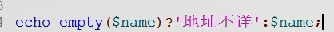

# day02

# 定义常量
define(常量名，值，是否区分大小写); 默认区分 ，true 表示区分

```php
define('NAME','tom');
define('PI',3.14);
echo NAME,'<br>',PI;    //输出即为 tom<br>3.14
```

特殊字符做常量名，输出需要constant 修饰


判断是否已经被定义


## 预定义常量
定义好的常量


附录-保留字列表-预定义常量


## 魔术常量
七个魔术常量


# 数据类型

## 特殊类型
1. 资源 resource
2. 无类型 NULL   //  php 中 null 不区分大小写

数据类型有两种类型：强类型 、 弱类型

弱类型：类型由 输入的值决定 。如var

强类型：类型由 定义前缀决定

php是弱数据类型

有八种原始数据类型


## 进制转换
* dex 十进制 
* bin 二进制
* hex 十六进制
* oct 八进制

前面为转换源，后面为转换目标
随意组合进行数据类型的转换


## 浮点数
浮点数在内存中保存的是 近似值
不能参与比较

若要比较，需要限定比较的位数


### 整数超出整形范围时，自动转成浮点数

## 布尔型
false 空
true 1

输出需要使用 var_dump();进行输出


## 字符串

单引号打印 纯字符。
双引号会解析 关键词。


双引号
    * \$ 会视其后面的所有字符(除非法命名字符外)为变量名
    * {} 用于限定变量名的范围
    


### 字符串定界符
<<<标识符开头
标识符; 结束
* 必须顶格写


<<<名字   \\ 加 单引号 叫nowdoc 不解析变量
    * 加单 叫 nowdoc   ;   不加 叫 heredoc 
内容，不用加分号
名字; \\结束


# 数组

## 数组的声明

\$stu=
1. array('','','','');  索引
    1. array(''=>'',1=>'','');  关联
1. ['','','','',''];   索引
    1. [''=>'','','','']  关联
    1. [\$num1,\$num2]=[\$num2,\$num1]; // 交换变量数值    php7.1 支持
    

### 二维数组的声明


### 交换数值  看上一行


### 索引数组 ，通过索引选取对象 : echo \$stu[0];
\$stu=array('tom','berry','ketty');

输出方式： print_r();   var_dump(\$stu);


### 关联数组
通过关联名选取数组元素
关联方式   array(关联名 => 元素)
注意：**若用数值进行关联，会接着该数值自动补齐**


## 特殊下标
下标带小数，将小数去掉
false 转为 0
' ' 和 null  都是同一个空下标


## 数组结合字符串用法

负数从后往前取，正数从前往后取


# 类型转换


空数组 、0、0.0、null、'' 均为空 、false


# 逻辑运算符的扩充

只做数值运算, 自动转字符串为数值

&  /   |  : 两边都要计算
&&  /  ||  与之前一样

# 字符串链接、错误抑制、null合并

## 字符串链接 .
    echo 'ab'.'ac';  //'abac'
    

## 错误抑制符@

只对表达式有效
@(表达式); //之后不会报错


## null 合并运算符 ??  7.0后支持

近似于 默认值

当 前一个数值为空 时，输出后面的内容


等效于调用 empty() 函数有的 三元运算符



# 判断
if()
{}
elseif()   // elseif  是连在一起的
{}


超全局变量 $_POST  
    * 用于存放 post 方式提交的数据
    * 用数组的 形式存放
        * 按钮中的 name 属性 ，就是php \_POST中的 数组关联名
        * 读取不到没有设置 name 属性的提交内容
        

## php 判断年份


## php 嵌套html ，js ，更改字体颜色
