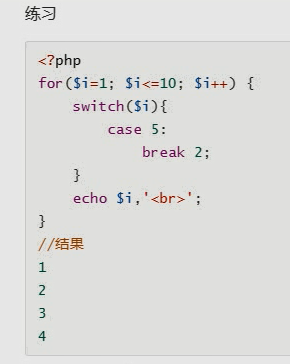
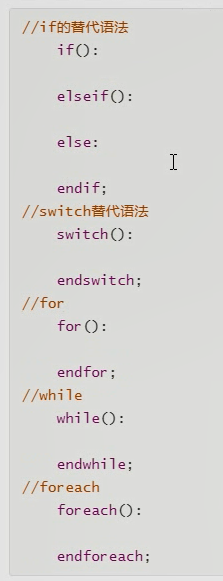
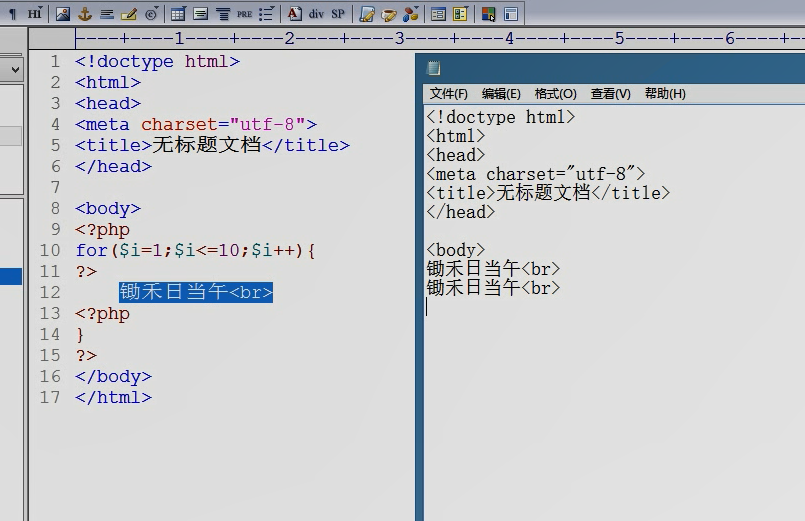
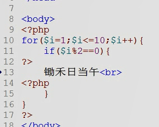
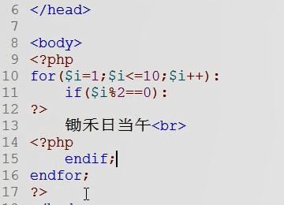
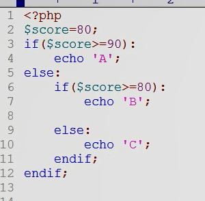

# day03

foreach 循环  遍历数组
```php
foreach($array as $val)      把数组array 的值赋给 val
{
    echo $val."\<br\>"
}
```

```php
foreach($array as $key->$val)    把数组array 赋值给val ,把 键 赋给key
{
    
}
```

## 跳转语句

break n;  跳出 n 层循环

switch  本质是循环了一次的循环




## 替代语法

php中 除了 do-while 以外,其他的语法结构都有替代语法

规则:    左大括号变冒号, 右大括号变  endXX
嵌套规则: 左大括号变冒号, 右大括号删掉, 只需加在最后





## 应用场景: 混编语法
for循环  作为html 的控制流命令使用




替代语法使用前:


替代语法使用后:



## 替代语法证明 else if是嵌套语法

