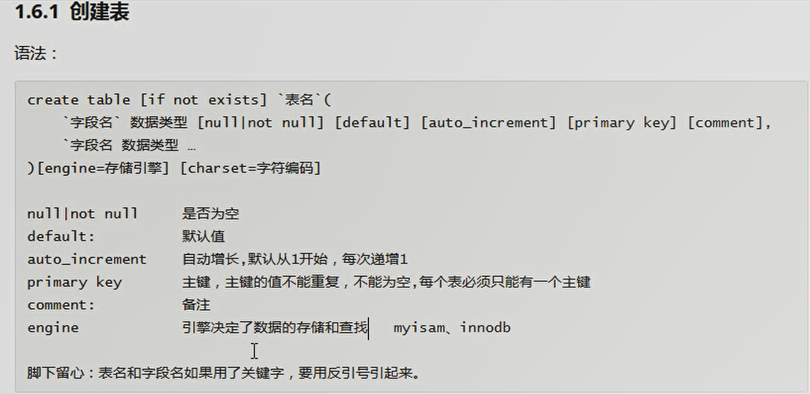
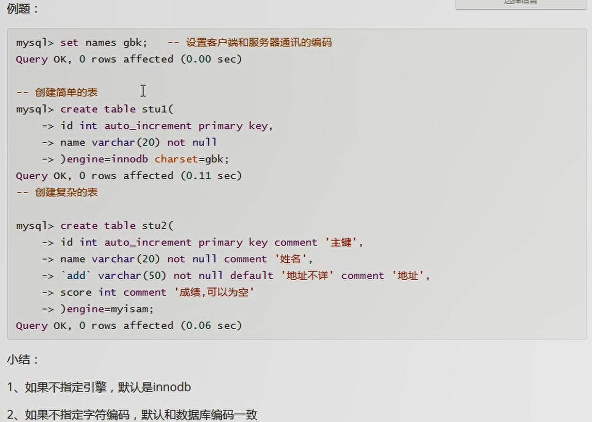
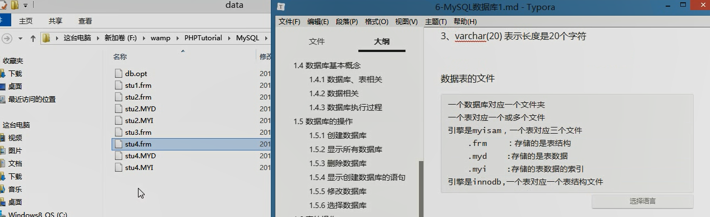
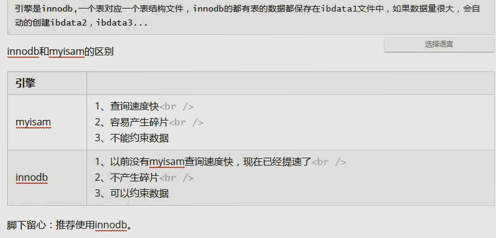
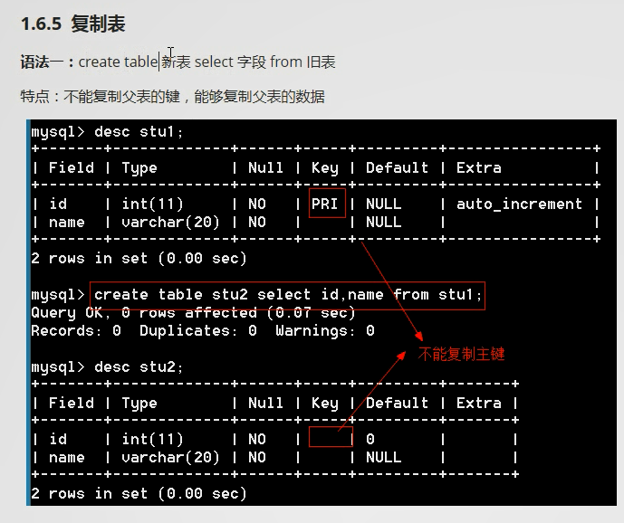
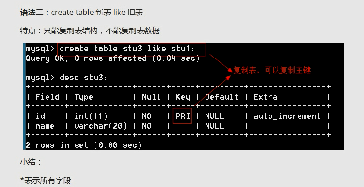

# 2022-03-05

## 数据库
数据库>表>数据

数据库历史：
文件系统 -> 一代数据库 -> 二代数据库

### 一代数据库
* 层次模型
    * 类似于文件夹机制 
* 网络模型
* 关系模型

### 连接数据库
* 命令行连接
* host                 -h 主机
* port                -P 端口
* user                 -u 用户名
* password        -p 密码

* mysql -h  -P  -uroot -proot    服务器是本地，端口是3306时，可以省略
* mysql -uroot -proot  明文输入
* mysql -uroot -p 密文输入

###  数据冗余
* 冗余：相同数据存在不同的地方
    * 冗余只能减少，不能杜绝
    * 对付冗余的方法是分表
    

### 数据完整性
数据准确性+数据正确性=数据完整性

### 命令
show databases;
create database [if not exists] ---
create database emp charset=gbk; 指定创建编码类型
show variables like 'character_set_%'; 查看数据库应用编码类型
drop database `%$`;  删除数据库
drop database if exsists `%$`;
show create database emp;  显示创建数据库的语句
alter database emp charset=utf8;  修改数据库字符编码，且此为唯一选项
use emp; 选择数据库
show tables; 
show create table stu2;
show create table stu2\G;  纵向排列
describe stu2; 
desc stu2;  查看表结构
drop table if exists stu; 删除表
drop table stu1,stu2;  连续删除表
create table stu1 select id,name from stu2;  复制表 ，不能复制主键    可以复制内容
create table stu3 like stu2; 复制表，可以复制主键    不能复制内容
select * from stu40;  显示stu40中的所有字段内容
select name from stu2; 显示stu2中的name字段内容
alter table stu add lala char(2) first;  添加列 字段 并位于第一个
alter table stu add lala char(2) after name;  添加列字段 并位于 name 之后
alter table stu drop lala;   删除lala字段
alter table stu change name stuname varchar(20); 修改字段 name 到 stuname
alter table stu modify sex varchar(20);  修改sex字段属性为  varchar(20)
alter table stu modify `add` varchar(30) default '地址不详';  修改字段add属性 varchar(30), 默认为 '地址不详';
    * 使用默认的时候，需要先 set names gbk;

alter table stu engine=myisam;  修改引擎
alter table stu rename to student;   修改表名  student
alter table student rename to php74.stu;   将当前数据库中的 表student 移动到数据库php74 并改名 stu；

insert into stu(字段名, 字段名) values(对应顺序放入内容) ; 
insert into stu(name,sex,'add') values('mark','male','浙江');
不写字段名
insert into stu values('mark',null,default); null 空，default 默认值 为关键字
插入多条数据
insert into stu values('mark',null,'liming'),('dean','man','liaoming');
查询数据
select * from stu;

### 修改数据库
修改数据库的选项只有字符编码
MySQL 中 utf字符编码之间没有横杠 utf8          

### 创建表

### 表文件

### 数据库名使用关键字和特殊字符方法
加上反引号

### 数据库配置 my.ini
1. 数据目录 datadir="";
2. 一个数据库对应一个文件夹，文件夹下 db.opt文件中 设置数据库的字符集和校对集；   —— 校对集 区分大小写和比较字符大小

### 复制表

