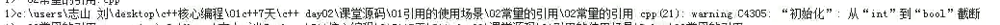

# 引用概述

## 引用概念     (重点难点)
指针的功能：节省空间 —— 避免传参复制所有变量

变量本质：
1. 开辟一段连续的内存
2. 给该段内存取名
3. 使用变量名操作这段内存

---

引用作用
1. 引用做什么：与C指针一样，节省内存
2. 引用是什么：给内存取别名

---

引用：优化使用指针的繁琐步骤，使代码变得更简洁

类型名 &变量名 = 变量；  为右值变量的内存取别名。
(具体步骤：获取右边变量的地址并赋值给左值)

从指针角度理解引用：
1. 定义一个指针 获取 变量的地址
2. 对该指针解引用
3. 将该指针的星号省略，包装成非指针变量

引用的注意：
1. 创建时必须初始化
    - 引用本质是常量
2. 引用创建后不能改变指向
    - 引用 创建一个变量名，指向左值的地址并解引用。
3. 引用必须引用一块合法地址。
    - 注意引用地址的开辟与释放
4. 不能引用常量


## 数组引用

数组引用方式：
1. 大量使用同类型数组
```cpp
int arr[5] = { 1, 2, 3, 4, 5};
typedef int (MY_ARRY)[5];
MY_ARRY& a = arr;
```

2. 灵活、快速创建数组
```cpp
int arr[5] = { 1, 2, 3, 4, 5};
int (&a)[5] = arr;
```

3. 大量使用同类型数组引用
```cpp
int arr[5] = { 1, 2, 3, 4, 5};
typedef int (&MY_ARR)[5];       //建立引用数组类型
MY_ARR a = arr;
```

## 引用本质
引用的本质是 常指针

原理：
1. 编译器发现是引用定义
    - 转换为 常指针定义
2. 编译器发现是引用类型
    - 加上星号解引用
    
```cpp
int a = 10;
int& aRef = a; // 自动转换为 int* const aRef = &a;
cout << "a:" << aRef << endl;  // 发现 aRef 的类型是 引用，转换为 *aRef
```


## 尽量用 const 代替 define
原因：
1. define 没有类型
    - c++ 存在 方法重载
    - 允许存在同名函数
    - 根据类型匹配同名函数
2. define 不能限定作用域
    - 容易出现定义同名情况
    
注意：尽量不是一定
define 可以用于替换情况，方便移植等。


## 指针的引用
引用的原理是获取变量名的地址，并用另一变量名指向该地址。
因此，引用可以用于不同类型的变量，包括指针。
使用方法： 与被引用变量相同类型即可


## c++ 与 c 语言的区别
1. 类型严格要求，无隐式转换
2. const修饰的变量 有时有内存，有时没内存。c语言均有
3. 结构体使用不用加 struct
4. 结构体内可以 定义函数成员
5. 三目运算符返回的左右值不同
6. 引用与c指针功能相同


## const 的常量引用 和 bool 类型
不能直接对常量进行引用
需要使用const 进行常量的引用
```cpp
const int &ref = 10; // 这个 10 没有分配空间，存在于指令表中
//编译器内部进行的操作：
//1. int tmp = 10;
//2. const &ref = tmp;
```
注意点： 常量引用不占用内存空间，与 int 、变量名等同，存在于指令表中

c++中 存在 bool 类型，只有两个值 true & false.
0 -> false , 1 -> true 
除0 , 1 外其他值， 发生截断，转换为 1




## 内联函数       (了解)
针对 宏函数 缺陷改进。

宏函数特点： 高效率
1. 用来写短小、频繁的函数 提高程序运行速度
2. 宏函数替换特点 会使得在 使用过程中出现错误

宏函数的误用案例：
- 未加括号的运算情况，运算优先级发生变化    
```cpp
#define ADD(x,y) x+y;
int ref = ADD(x,y) * 2;// 等价于 x + y * 2;
```
- 使用自增自减的情况
```cpp
#define COMPA(x,y) ((x)>(y)?(x):(y))
int a = 1, b = 5;
int ref2 = COMPA(++a,b);// 等价于 ( (++a) > (b) ? (++a) : (b) )
//a 自增了两次，使得结果出现变化
```

inline 向编译器申请成为内联函数
内联函数特点：有用宏函数的效率，没有宏函数的缺陷
1. 拥有与宏函数等同的高效率运行
2. 由编译器决定是否为内联函数，具有不确定性
    -  inline 关键字可以增强使其成为 内联函数概率
3. 优化了宏函数的使用缺陷


内联函数的不确定性刨析：
不能成为内联函数的情况
1. 套用任意形式的循环
2. 过多使用条件判断
3. 函数体过大
4. 获取地址

内联函数的处理过程：类型检查、类型转换、合适位置放入对象 this 指针
    了解预备知识 —— 对任何类型的函数，编译器会将函数类(包括函数名字，函数类型，返回值类型)放入符号表中。同样，当编译器看到内联函数，并对内联函数体进行分析没有发现错误时，也会将内联函数放入符号表。
    当调用内联函数时，编译器首先确保传入参数类型是正确匹配的，如果类型不完全匹配，但可以转换为正确类型，并且返回值在目标表达式里匹配正确类型，或者可以转换为目标类型，内联函数就会直接替换函数调用，这就消除了函数调用的开销。假如内联函数是成员函数，对象 this 指针也会被放入合适位置。
    小结、注意点 ——  类型检查、类型转换、合适位置放入对象 this 指针 都不是预处理器能完成的。
    

内联函数本质：给编译器的一个建议
(编译器不一定会接收这种建议，即便没有将函数声明为内联函数，编译器也可能将此函数做内联函数。)
一个好的编译器会将内联小的、简单函数做 内联编译。

## 函数的默认参数和占位参数     (重点)


默认参数：给形参赋值
1. 提高了函数的灵活性
2. 默认参数后面必须全是默认参数
3. 函数的实现与声明不能同时使用默认参数  // 重定义情况
    - 默认函数无论用在声明 或 实现均可，二者只存一

使用方式：定义参数并初始化赋值。
应用场景：在有常用值的情况下，偶尔需要不同的值


占位参数：形参占位
1. 占一个类型的空位

应用场景：在后面重载运算符区分前加加 与 后加加
使用方式：在参数位只写上类型


默认参数与占位参数的混合使用：
占位参数可以进行初始化 ——     func(int a, int = 10);
初始化后可以省略该参数的传递  ——    func(10); func(10,20);


## 函数传递参数的三种方式
1. 值传递
    - 不改变实参
2. 指针传递
    - 指针方式改变实参
3. 引用传递
    - 引用方式改变实参
    
引用传递与指针传递的本质是一样的
引用传递相对指针传递便捷、简洁


