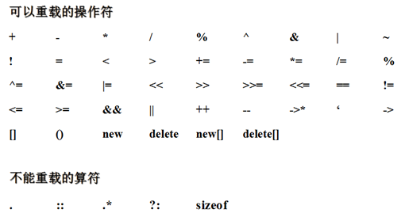

# 操作符重载
本质：实现的具体步骤封装成函数
原理：把类、对象的运算符 重定义调用函数
实际意义：在现有对象的基础上，抽象、重新组成、构造 一个不同状态的对象。
运用：对 两个对象 进行运算，得到第三个对象。

关键词 operator[+,-,*,/]\()  —— 作为函数定义标识符
- 返回值类型，为计算结果的类型
- 返回局部对象，会进行拷贝构造

加减乘除，是双目运算符

两种方式    ——    全局方式、成员函数方式
- 全局方式，传入两个运算对象
    - 第一个参数是左值
    - 第二个参数是右值
- 成员函数方式
    - 第一个参数是右值
    - 左值是本身对象,就是this
    
## 运算符重载
不能重载的符号  1 . 2 :: 3 .* 4 sizeof

## 继承特性：
除了赋值号(=)外，基类中被重载的操作符都将被派生类继承。

## 特殊运算符
    1. =, [], () 和 -> 操作符只能通过成员函数进行重载 
	2. << 和 >> 操作符最好通过友元函数进行重载
	3. 不要重载 && 和 || 操作符，因为无法实现短路规则

常规建议

理解技巧：站在 编译器 为程序员服务为的角度思考

# 左移,右移运算符重载

## 左移运算符重载
本质：调用 运算符重载函数
原理：结合 函数重载、返回值类型，以运算符重载的方式，实现左移打印
实际意义：可以更加灵活、更加宏观的把握 运算符的思想，将其与实物相结合，根据实际情况，对应出不同的运算含义。
运用：把握对象特定特征 变化的规律，对该规律 运算符化。

左移运算符重载
1. cout 是 ostream 的对象，<< 是左移运算符
2. 约定 重载左移运算符 是为了打印
3. 不能改变库类中的代码
4. ostream 把构造函数私有化了

操作符重载 遇上 endl 
5. endl 是一个函数，返回值为函数指针
6. ostream的对象有 函数重载处理函数指针；
7. 使用endl，需要返回 ostram 对象

操作符重载 遇上 友元函数
8. 操作符重载函数中 需要调用 私有成员时, 在类中 声明友元

使用注意：
1. 返回iostream引用

## 右移运算符
本质：调用函数
原理：将scanf 获取输入，用运算符重载给 >> 

使用注意：
1. 关键字 cin
2. 将数输入给变量 
3. 例:  cin>> a >> b     — 从输入 分别给 a,b 赋值
