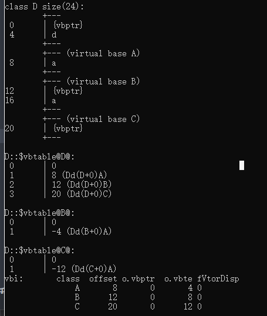

# 继承
回顾：
C++ 三大特性
1. 封装
    1. 权限
    2. 封装数据在类内
2. 继承
    1. 代码复用
    2. 扩展功能
3. 多态

小测试：
继承作用 1.____   2.____
继承三大方式 1.____   2.____  3.____

继承方式对应的 子类访问权限、子类使用权限
公有继承
|父类权限|子类权限|
|---|---|---|
|公有|公有|
|私有|私有|
|保护|保护|

保护继承
|父类权限|子类权限|
|---|---|---|
|公有|保护|
|私有|私有|
|保护|保护|

私有继承
|父类权限|子类权限|
|---|---|---|
|公有|保护|
|私有|私有|
|保护|私有|

总结：
1. 公有继承，保留父类所有权限
2. 私有继承，所有变私有
3. 保护继承，公有权限变保护。其余不变。

按隐私等级理解：
1. 公有继承，0级 保留原有权限
2. 保护继承，1级 不允许外部访问
3. 私有继承，2级 不允许继承访问

## 继承对象模型
名词补给站：
1. 派生类  —— 子类 由父类派生出来
2. 基类 —— 派生类 基于 父类 派生

方法：菜单-developer vs-进入工程文件夹
      使用命令：cl/d1 reportSingleClassLayout类名 文件名.cpp
      

### 注意点
子类继承父类，不能访问的私有属性 也继承过来了，由语法规定，只是不能访问

## 继承中的构造和析构的调用
类中构造、析构的调用对象有：父类、成员对象、自己、父类的父类、父类的成员对象
构造调用顺序：
1. 父类
2. 成员对象
3. 自己

析构反之

调用顺序的作用：
调用顺序可以让我们知道，编译器调用这个函数需要哪些条件
即创建该成员对象的前提是 父类、成员对象、自己的析构函数 必须能够被调用

## 继承中 存在同名成员情况
约定：
1. 优先访问子类 同名成员
2. 父类同名成员、同名函数及重载函数 隐藏

访问同名父类方法：
加上在该同名成员前加上 父类名::

例：son.father::func();

### 静态成员特性
静态成员函数不能是虚函数

### 不能被继承的函数
1. 四大初始函数：构造、拷构、析构、赋值
2. 赋值运算符重载函数

### 多继承
继承两个以上的父类

使用方式：用逗号隔开，写上 继承方式和父类名 

例：class Son :public Father, public Mother

### 菱形继承
虚继承：
本质：创建指针，指向一块空间。
原理：相同基类的指针，指向同一块空间。
实际意义：A、B是C的儿子，A的父亲和B的父亲都是C。解决了A的父亲不是B的父亲问题。
运用：继承两个基类的基类为同一基类时，使用虚继承，使该基类为同一基类，消除二义性。
ps:即父类虚继承祖类，使用virtual关键字

虚继承使用手册：
1. 在继承基类的 权限前 加上 virtual 
2. 例：class Son :virtual public Father
3. 生效条件：使用虚继承的基类派生子类

类的结构：
1. 虚指针
2. 本类成员变量
3. 父类成员变量

虚继承的指针 
1. 使继承的基类对象 具有唯一性
2. 以表格的形式存储 子类对象到 基类对象的偏移量

指针位置：在成员变量前
指针表格内容：
1. int类型
2. 与基类成员变量的 偏移量
3. 有几个基类，就有几个偏移量
4. 辈分从大到小排列
5. 偏移量 相对指针本身来说
6. 指针 排列在该类的成员变量之前

如图所示： A 是 B，C的基类  D是 B, C 的派生类  

## 通过指针访问成员变量
原理：通过指针指向地址进行跳转

思路：
1. 跳转到虚指针指向表格 取偏移量
2. 取对象首地址 + 偏移量
3. 转基类类型
4. 通过成员选择选取对象

(转基类类型(对象首地址 + 到基类对象的偏移量))->成员变量

## 动态联编、静态联编    重点难点
核心意境：寻址方式

静态联编
定义：在编译阶段确定好了 函数调用地址。

小测：
程序编译四大步骤
1._____  2._____ 3._____ 4.______

动态联编
定义：在运行阶段确定 函数调用地址 称作，晚绑定 

问题：
静态联编在 编译阶段就确定了函数调用地址，当传入子类对象时，仍然调用父类函数地址。

解决方案：
为了方便添加新的功能，动态联编的晚绑定，在运行阶段绑定调用子类的 函数地址。
方便实现不改变 原代码，添加新的功能。

类型转换：
子类转成父类(向上转换)：指针寻址范围缩小，编译器认为是安全的。
父类转成子类(向下转换)：指针寻址范围扩大，编译器认为是不安全的。

## 虚函数 （接上面的）
使用手册：
1. 创建虚函数：在普通函数前面加上 virtual —— 告诉编译器这个函数要晚绑定
2. 形参写父类指针
3. 传入子类对象指针
4. 调用函数时，实现调用子类对象函数

