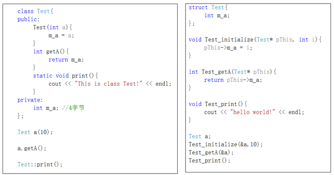

# 构造和析构概念

### 快速理解：
构造函数在 类创建时 由编译器调用。
用于：实现创建该类所必须使用的功能。
有参构造函数，在创建类的时候必须提供参数。

析构函数 在调用类的函数 结束时调用。
用于：释放类创建时申请的空间，避免忘记释放空间造成的空间泄露。


#### 生活小技巧：磁盘数据被删除后，很容易恢复数据。删除后用数据覆盖，能提高删除数据的恢复难度。


### 存在特性：
1. 创建几次对象. 就要调用几次构造、析构函数
2. 由编辑器调用. 无法主动调用
3. 创造目的在于 初始化、清理. 

### 使用要求：
2. 构造函数可以函数重载
3. 构造函数可以有参数
5. 析构函数没参数
1. 函数名必须与类名相同
4. 必须是 公有权限
6. 没返回值

#### 默认的构造函数、析构函数：
函数体是空，看不见


## 拷贝构造
调用拷贝构造
```cpp
Maker m1(10);//调用有参构造
Maker m2(m1);//调用拷贝构造
Maker m3 = m1;//调用拷贝构造
```
从而引出 拷贝构造不使用引用会陷入死循环
m3 = m1   ——> m3(m1)    ——> m3=m1 ——> ...


```cpp
class Maker
{
public:
    Maker(const Maker &m)
    {
        a = m.a;  // 对成员变量进行拷贝
    }
    
private:
    int a;
}
```

**编译器提供了默认的拷贝构造**

前提了解：

编译器对一般形参非引用的赋值方式：
例如：
```cpp
func(const a)
{}
func(b);
```
const a = b;

编译器对类数据类型 形参 赋值方式：
使用拷贝构造进行拷贝

```cpp
class func
{
private:
    int c;
}
func d;
func e(d);
```


使用特性：
1. 必须使用引用
```cpp
class Maker
{
public:
    Maker(const Maker m)
    {
        a=m.a;
    }
    
private:
int a;
}

Maker m1;
Maker m1(m2);
```
const m = m2;       =>*调用拷贝构造*         m(m2);   =>  *进行赋值*  m=m2;
陷入死循环。
此处必须使用引用


## 构造函数的分类与调用
三种构造函数： 无参、有参、拷贝

Maker m; // 调用无参构造函数
Maker m1(10); //调用有参构造
Maker m2(m1); //调用拷贝构造


// 不常用
Maker m4 = Maker(10); //调用有参构造
说明：
创建匿名对象 Maker(10)，并命名为 m4

Maker m3 =m2; //调用拷贝构造

Maker m5=10;//调用有参构造
说明：
编译器优化为  Maker m5 = Maker(10)

### 赋值操作 与 拷贝构造的区分
拷贝构造只有在 对象创建的时候进行。

Maker m6; //创建对象，调用无参构造
m6 = m5; //赋值操作


## 类中默认存在的四个函数
1. 空构造函数
2. 空析构函数
3. 拷贝构造
4. 赋值函数  //实现对象的赋值
    - 涉及到操作符重载


## 匿名对象(了解)
应用：异常时用到

格式：类名+();

单一的匿名对象，生命周期只在当前行。

Maker m1; 
执行构造函数，主调函数结束时. 执行析构函数

Maker();
执行构造函数、析构函数。

Maker m2 = Maker();
执行构造函数，主调函数结束时. 执行析构函数
* 注意：匿名对象有名字来接，不是匿名对象


## 拷贝构造的调用时机(重点)
**第三点非常重要**

1. 以值的方式进行传递
    - 作为函数的参数，传递给形参时
    - 该形参对象调用拷贝构造
2. 用已有对象初始化另一个对象
    - Maker m1(m2);
3. 作为局部对象 以值的方式返回 
    - Maker m = func(); //func() 是一个返回值为对象的函数
    - 在func() 函数结束前，在主调函数创建对象 并调用拷贝构造，函数结束  
    - 此处相当于 给匿名对象重命名为 m ，Maker m没有进行创建对象的操作
    

* 注意：以对象为返回值 函数的调用详细过程
1. 调用函数  进入函数作用域内
2. 创建对象...中间过程跳过
3. 执行到 return
4. 在主调函数以拷贝构造方式，创建匿名对象
5. 函数作用域内对象 调用析构函数
6. 函数结束


时机3 局部对象返回 编译器相关补充：
1. vs Debug 模式下，会使用拷贝构造
2. vs Release 模式下，不会调用拷贝构造
3. qt 也不调用

不调用的情况：
编译器的优化机制
发现用户还需要使用该局部对象时，不释放空间，将该空间返回继续使用。

## 构造函数调用规则(重难点)
1. 提供有参构造，编译器不提供默认构造
2. 提供拷贝构造，编译器不提供默认构造、默认拷贝构造


## 多个对象的构造函数和析构函数(重难点)

情况：
对象做 类的成员对象

调用规则：
构造：先调用 成员对象的构造函数，再调用自己的.

析构：先调用 自己的 析构函数，再调用对象的.

成员对象的构造函数调用 与 定义顺序一样。
成员对象的析构函数调用 与 定义顺序相反。

如果，有成员对象，实例化对象时，必须保证成员对象的 构造和析构 能被调用。

成员对象不能直接调用的情况：
1. 定义有参构造、没定义无参构造


初始化列表：
作用：调用对象 构造函数

特性：
1. 写在构造函数
2. 一旦使用，所有构造函数都需要写初始化列表
3. 多个对象调用构造函数，用逗号隔开
4. 构造函数 能传递数值 给成员对象 的变量

例：
Maker(int a) :BMW2(a), dui(100,200)
{}


## 深浅拷贝
浅拷贝：对值进行拷贝

默认拷贝构造使用的是浅拷贝

浅拷贝的缺点：
当成员函数开辟空间时，会造成同一块空间的二次释放。

深拷贝：
开辟另一块空间，拷贝字符到空间。


## explicit 作用(了解)
用于阻止编译器优化 Maker m = 10; 这种格式，使代码可读性更强。


应用场景：
构造函数  只有一个参数 或 其他参数有默认值

使用规范：
放在构造函数前面


## 申请堆区空间 和 释放堆区空间
问题需求：
c语言 malloc 和 free 申请空间 必须流程
1. 判断是否申请成功
2. 释放判断是否为空
3. 指针置空

矛盾：
malloc  和  free  创建对象时，不会调用构造函数 和 析构函数


解决：c++ 提供 new  delete  进行堆区申请

可以申请堆区 并 调用构造函数 引出问题  ——  调用指定构造函数方法
具体方法：
Maker *m= new Maker(10);
在 new 申请空间时 传入参数，申请空间


malloc & free  与   new & delete 共同 、不同之处
共同：
1. 向堆区申请释放空间 
2. 返回空间首地址

不同：
1. new & delete 可以调用 构造函数 析构函数      malloc & free 需要手动 初始化、释放空间
2. new 自动判断是否申请成功
3. new 自动计算需要申请空间大小
4. malloc 返回 void*类型地址 ，new 返回 所需对象类型地址


### new & delete 申请释放 数组空间
1. 创建时，使用数组类型，释放时，也要使用数组类型 【否则只释放一个元素的空间】
    - int *pInt = new int[10]{1,23,...};
    - delete[] pInt;
2. 堆区申请释放 对象数组
    - Maker *ms = new Maker[2];
    - delete[] ms;
   
大部分编译器不支持创建 有参对象数组  —— 聚合初始化
Maker *ms2 = new Maker[2]{Maker(10), Maker(20)}; 


注意：new 创建的对象名 不能与类名相同


### void* 类型接 堆区对象空间地址 注意
```cpp
void *m = new Maker;

delete m;
// 不会调用 析构函数
```
不会调用析构函数的原因：
编译阶段：编译器确定好 函数的调用地址
C++ 编译器不认识 void* 不知道void* 指向哪个函数，不会调用析构函数
在编译阶段 确定好函数调用地址，这种编译方式 叫静态联编

## 静态成员(了解)
创造原因：节省空间，时间

分类：
1. 静态成员变量
2. 静态成员函数


静态成员特性
1. 静态成员变量的声明周期是整个程序，作用域在类内
2. 静态成员变量要在类内声明，类外初始化
    - 声明格式： static + 数据类型 + 变量名               : static int a;
    - 类外初始化： 数据类型 + 类名 +作用域符号 + 静态成员变量名 = 值
    - int Maker :: a = 100;
3. 静态成员变量属于类，所有对象共享            ——         节省空间
4. 静态成员变量可以用类访问，也可以用对象访问
    - 使用类访问 格式：类名 + 作用域符号 + 静态成员变量名    ： Maker :: a ;
    - 对象访问    对象 + . + 静态成员变量名
5. 静态成员函数 只能访问静态成员变量            ——          面向 静态成员变量 创造
    - 声明格式： static + 返回值类型 + 函数名(形参)            : static void setA(int a){}
6. 静态成员也有权限，如果为私有，类外也不可以访问
     - 静态成员变量 私有权限    不影响 类外初始化
7. const修饰的静态成员变量 可以直接初始化  且最好在类内初始化
    - 声明： cosnt static + 数据类型 + 变量名 ： const static int a;
    - 声明并初始化  : const static int a = 30;
    - 类外初始化： const + 数据类型 + 类名 + 作用域符号 + 变量名         :     const int Maker :: b =30;
8. 普通成员函数 可以访问静态成员变量

## C++ 的对象模型    (重点)
1. 空类大小 是1  (方便编译器 从内存上 区分对象)
2. 只有普通成员变量 占类的大小
3. 类的成员中 成员函数 和成员变量 是分开存储的

*静态成员变量、静态函数、普通函数 不占用类的大小*

一个类的内容  以多个结构体的形式存储在  编译器中



## this 指针     （重点难点)
this指针 ：把指向成员变量的指针 传到成员函数中

注意：对象有 this指针  ， this指针 不属于对象，  是编译器添加的

1. 每个对象都有一个 this 指针，由编译器分配  不占对象空间
2. this指针 指向对象地址
3. 在调用时，传入成员函数  以区分不同对象调用函数

this指针 作用：
1. 当形参与成员变量名 相同时，区分开来
2. 返回对象本身


### 拓展
1. this指针 指向的空间有没有存储静态成员变量？
没有。静态成员变量 不存储在对象中
—— 因此，静态函数中，不能使用this指针。
2. this指针 指向可以改变嘛？
不能改变，   this  ——  Maker *const this

## 常函数 常对象
### 常函数
原理：const 修饰 this 指向的那块内存区域 ，使之不能修改。

原 this指针 Maker* const this
常函数 this指针 const Maker* const this

使用：函数括号之后加上 const

特点：
1. 不能修改 成员变量
2. 可以修改 mutable 修饰的函数

### 常对象
原理：const 修饰 对象

使用：定义对象类前加上 const    

特点：
1. 不可以修改 普通成员变量
2. 不可以调用 普通成员函数
3. 可以调用 常函数
4. 可以修改 mutable修饰成员变量