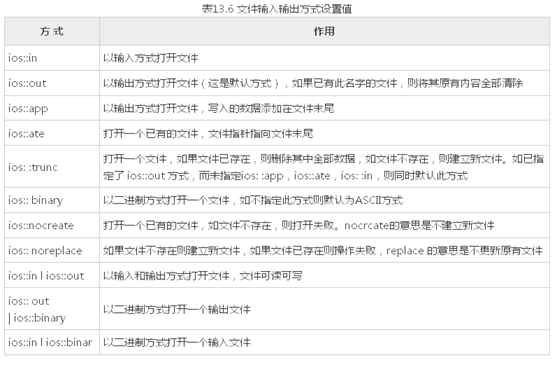

# 文件读写
问题：
写入时，/0 是否会转换为 回车符？
不会

使用 << 读取文件时，读到文件末尾返回什么？
返回 -1  字符以两个空格显示

文件的getline 在读取完所有字符后，会加上一个换行符

流程：
输出方式：
1. 引入头文件 fstream;
2. 定义文件流对象  ofstream ofs;
3. 打开文件 ofs.open("文件",ios::out | ios::trunc);
    1. 以写的方式打开，如果没有文件则创建
4. 判断打开是否成功 ofs.is_open()
5. 写信息
    1. 左移运算符直接写入
    2. ofs<<"contents"<<endl;
6. 关闭文件

输入方式：
1. 引入头文件
2. 定义文件流对象 ifstream ifs;
3. 打开文件 ifs.open("文件名",ios::in);
4. 判断是否打开成功 ifs.is_open();
5. 读信息
    1. 右移    ifs>>params
    2. ifs.eof();    判断是否读到文件尾部
    3. ifs.getline(arr,sizeof(arr));   读到文件尾部，添加一个换行符
    4. while((c = ifs.get()) != EOF); //单字符读取,判断是否读到行尾

## 打开文件注意项

ofs.open("文件",ios::out | ios::trunc);
- ios::out   存二进制 16
- ios::trunc   存二进制 2
- 通过按位或运算，返回值

## 二进制读写的问题
输入：ifs.open("name",ios::in | ios::binary);
输出：ofs.open("name",ios::out | ios::trunc | ios::binary);

读取信息：
- ifs.read((char*)&param,sizeof param);  
- 将缓存区中的 字符读到 变量。

## 文件读写 string问题
string类中 成员指针 char* 指向存储字符串的空间
当我们把 string 类的数据存储到文件中，再读出来，不能保证指针有效。
Ps: string 开辟的空间大于16字节 就在堆区，小于就在栈区

