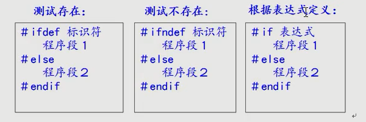

# 预处理指令

宏定义注意事项：
1. 宏常量不重视作用域
2. 没有数据类型
3. 可以利用 undef 卸载宏
4. 宏函数 用于频繁短小函数 封装为宏函数
5. 声明时候 注意保证运算完整性

__在宏定义中可以使用已定义的宏名__

头文件包含
    “” 自定义头文件
    <>   系统头文件

#ifdef       测试存在
#ifndef     测试不存在
#if             自定义条件
#undef     终止宏定义作用域

\_\_FILE\_\_      宏所在文件 de 源文件名
\_\_LINE\_\_     宏所在行号
\_\_DATE\_\_   日期
\_\_TIME\_\_    时间
