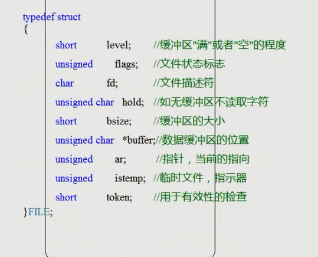

# file

## 磁盘文件和设备文件
磁盘文件： C盘等中可见的文件
设备文件：标准输入stdin，标准输出stdout，鼠标、键盘、显示器等设备文件，存在内存中，不可见

### 二进制文件 和 文本文件

* 文本文件
    * 将文本转为ASCII值，以二进制形式存在内存中
    
* 二进制文件
    * 直接以二进制形式存在内存中

## 文件流指针
通过函数fopen打开一个文件，返回的文件结构体指针，称为文件流指针。

定义方法：FILE* P = fopen("a.txt");

文件流的结构：

## 设备文件
1. stdin
    1. 标准输入文件
    2. FILE* stdin=fopen(stdin,"r");
2. stdout
    1. 标准输出文件
    2. FILE* stdout=fopen(stdout,"w");
3. stderr
    1. 标准错误文件
    2. FILE* stderr=fopen=(stderr,"w");
    

## linux和Windows *文本文件* 中\n 的区别

* windows
    *  写入时 \n => \r\n        ;
    * 读取时  \r\n=>\n         ;
\r 是回到行首
    
* linux 
    * 读取以及写入时  \n=>\n ;  
    
* **注意：linux 写好的文件，在Windows中无法显示回车   
windows中 ，读取时，只有\r\n 会转换 \n **

在windows 中 b 代表二进制文件，linux中，加不加b 都一样

## 缓冲区  临时内存空间
问题：写入字符到文件时，需要调用系统调用，进入系统内核
进入系统内核需要消耗资源和时间
解决方案：设置一定的内存空间作为缓冲区，将要写入的字符都存入缓冲区中，一次性写入。

缓冲区的释放途径
    1. 程序正常退出
    2. fflush();强制刷新
    3. 缓存区满

### 标准输出 stdout
windows 下 stdout 没有缓冲区 
linux 有缓冲区，加 \n 才能刷新出来

### 标准输入 stdin
不能使用 fflush() 刷新缓冲区 