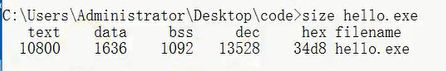
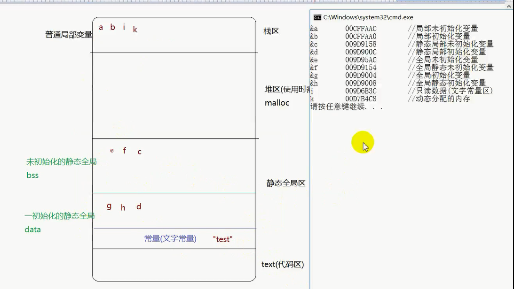

# memory
---

## 作用域 与 变量
---
### 作用域
    * 含义：函数作用的范围。
    * 作用域内可直接调用，作用域外 可使用指针调用。
    * 

类别

代码块作用域 : 代码块是指:{}之间的一段代码 函数作用域 文件作用域 

    
### 变量
    * 

类别

局部变量：在{}内的变量 静态局部变量:局部变量加上 static  全局变量 : 在函数之外的变量 静态全局变量 : 全局变量前面 加上 static
---

>## 局部变量与静态局部
---
### 局部变量
    * 生命周期：在函数定义处**开辟空间**，函数结束时**释放空间**。**函数指 主体函数 ，一般为 main 函数**
    * 作用域 ： 作用在代码块内{};
        * 作用域内可直接调用，作用域外 可使用指针调用。
    * 未初始化值 随机；
        
### 静态局部
* 静态的特点，在主体函数运行之前就已经执行，之后遇到，则跳过、忽略。  未初始化值为0；
    * 生命周期 ：在main()函数运行之前，开辟空间，程序结束时释放空间。   ***--未调用之前不可使用。--***
    * 作用域 ：作用在代码块内{}；
        * 作用域内可直接调用，作用于外 需使用指针调用。
    * 未初始化值为 0；
---
>## 全局变量与静态全局
---
### 全局变量
* 作用域 ：整个工程、所有文件。不同文件调用时，extern 声明即可。
* 生命周期:main()函数之前开辟，程序结束之后释放。
* 初始化值 0；

### 静态全局
* 作用域 ：当前文件。其他文件不可调用，可避免重名情况。
* 生命周期：main()之前开辟，程序结束之后释放。
* 初始化值 0；

### 小结：
* 局部变量(普通局部和静态局部)在{}范围之内   普通全局变量作用域在整个工程  静态全局作用当前文件
* 生命周期 ：只有普通局部变量运行至变量定义处开辟空间，函数结束时释放。其他变量都是 main函数执行前开辟空间，程序结束之后释放。
* 初始化的值 ：只有普通局部未初始化的值为随机，其他为0；

---
### 全局变量的文件问题
* .h头文件里一般只声明，不定义。  ——  .h 头文件可能被包含多次，而进行重定义会出错。
* 定义只放在 .c 文件中。

## 变量重名问题
* **不同作用域之间的变量可以重名。**

## 静态函数
* 定义时 加上 static 修饰的函数；
* 普通函数 就是 全局函数 ，可被整个工程调用
* 静态函数只能被当前文件调用
* 可通过普通函数跨文件调用其当前文件的静态函数
* -- 静态函数用于 在大量函数定义的工程中，避免重名

## 内存分布
* 相当于设计图
* 在程序启动之前就已经规划好的内存
    * 局部变量是在启动时才进行规划的 ---- 局部变量存的地方(位置)是规划好的      相当于房间准备好了，还没往里面放东西

|  text  |  data  |      bss      |
| ------ | ------ | ------------- |
| 代码区 | 数据区 | 未初始化数据区 |

在命令行中 输入  size 文件  可查看文件内存分布

*静态全局：普通静态、全局静态、全局变量*
|    栈区    |                 普通变量区                  |
| :---------: | :------------------------------------------: |
| 堆区       | 普通局部变量                                 |
| 静态全局区 | 初始化静态全局 未初始化静态全局 文字常量 |
| text区     | 代码区                                      |

## malloc 申请空间

malloc(字节数) 申请空间 ，返回的是  void类型 首地址。
可使用 需求大小的指针存。

malloc 申请空间用完之后，free(申请过的空间首地址,否则会出现各种问题) 进行释放空间         

# 内存泄漏 与 内存污染
* 内存泄漏 ：申请内存，不释放，导致占用内存一直增长。  ——  内存结束时，释放所有内存；
* 内存污染 ：向没有申请的内存空间写入数据。

# 返回变量地址
* 不能返回被释放了的地址 (否则会有隐性危险，相当于定时炸弹)
* 函数局部变量，在函数结束后释放空间。不能返回地址；
* 全局变量，在程序结束之后释放空间。可以返回；

# 返回堆区地址
* 函数申请的堆区，在函数结束后不会被释放
* 在函数中可以返回堆区的地址
* 要记得释放堆区空间，否则会造成内存泄漏

