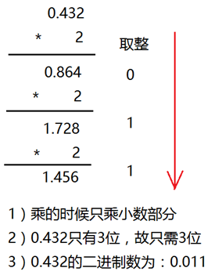

# 数据类型 && 变量
---
数据类型 —— 表示 该数据在内存中需要的空间大小

常量：程序运行中-不能改变的量{整形、字符、字符串、浮点型}

变量：程序运行中可被改变的量 - 存在于内存中 ——在内存中开辟空间  &&  声明该变量

|    数据类型     |                     变量名                     |
| -------------- | --------------------------------------------- |
| int 类型       | 4字节                                         |
| short 类型     | 2字节                                         |
| long 类型      | windows 4字节 , linux 32位4字节 , 64位8字节    |
| long long 类型 | 8字节                                         |
| char 类型      | 8位  一个字节                                  |
| time_t 类型    | 秒    配合函数 time() 使用，获取当前时间到秒    |
| clock_t 类型   | 毫秒  配合函数 clock() 使用，获取当前时间到毫秒 |


## 声明
extern修饰变量  —— 用法：在声明变量的数据类型前 添加
作用：告诉编译器有这个东西，但不分配内存空间

## const修饰变量  ——  静态变量
作用 ：使修饰的变量不能被更改
· 原理 ：不能通过声明的变量名修改该内存空间，但可以通过地址来修改  注：const全局变量 不可通过地址来修改


## 关键字 32个
· 数据类型关键字(12个) 
char , short , int , long , float , double , unsigned , signed , struct , union , enum , void
· 控制语句关键字(12个)
if , else , switch , case , default , for , do , while , break , contiue , goto , return
· 存储类关键字(5个)
auto , extern , register , static , const
· 其他关键字(3个)
sizeof , typedef , volatile


## 进制

### 二进制小数算法


### C 语言中 八、十六进制的书写
八进制：0123
十六进制：0xabc


### 进制转换 例子
八进制转二进制：
因为八进制的最大值是7 ，而 7 可以用三位二进制表示，所以我们用三个二进制表示一个八进制

### 8 进制的书写和打印

  

数在计算机存的内容没有改变，打印时只是输出的形式改变而已
```c
#define \_CRT\_SECURE\_NO\_WARNINGS

#include<stdio.h>

#include<string.h>

#include<stdlib.h>

int main()

{

 int b = 056;

 //

 printf("a=%o\\n", b);

 printf("a=%X\\n", b);

 printf("a=%d\\n", b);

 system("pause");

 return 0;

}

int main02()

{

 int a = 123;

 int b = 056;

 int c = 0xab;

 printf("a=%d\\n",a);

 printf("a=%o\\n", b);

 printf("a=%X\\n", c);

 printf("a=%#X\\n", c);    // #是给 十六进制和八进制的数值加上 前缀， 0x 、 0

 system("pause");

 return 0;

}
```

## 有无符号数

char类型默认有八位

---

### signed char num; 有符号数
* 默认为有符号   最高位为符号位
* 符号位 ---  1 负数  0 正数
* 可以表示整数和负数  

---
### unsigned char num;无符号数
* 只能表示正数
---

### 数的范围
#### signed char 
1 0000000  -  1 1111111 -0 - -127
0 0000000  -  0 1111111 +0 - +127
规定 ：将 -0 视为 -128
范围 -128 - +127
总共可表达 256 个数
--- 
#### unsigned char
0000 0000 - 1111 1111
范围 0-255
可表达 256 个数


#### 类推 其他数据类型的范围
short
signed short ($-2^{15}$-> $-2^{15}$-1  )
unsigned short (0 -> $2^{16}$-1  )

int
signed int ($-2^{31}$ -> $2^{31}$-1)
signed int (0 -> $2^{32}$-1)


## 原码反码补码
### 原码
数的最原始的二进制码

### 反码
正数的反码不变 ，负数的反码(符号位不变 ，其他位取反)
例：-0：1111 1111
      +0：0000 0000
       -1：1111 1110
        1： 0000 0001
        1 + -1 = 1111 1111 = -0
        若使用反码存，负数的运算结果正确 ，但 0 的状态还是有两种
        
### 补码
正数的补码不变 ， 负数的补码等于负数等于反码加1
例：-0 ：0000 0000
      +0：0000 0000
      -1：1111 1111
      1：0000 0001
      1 + -1 = 0
      若用补码去存，负数运算结果是正确的 ，0 的状态只有一种
      
### 总结
计算机中 都是用补码去存 正负数 
正数的 反码、补码均不变
负数的 反码取反 (符号位不变)       、    补码等于反码加1

#### 补码求原码
           

**在计算机系统中，数值一律用补码来存储。**

补码特点：

l 对于正数，原码、反码、补码相同

l 对于负数，其补码为它的反码加1

l 补码符号位不动，其他位求反，最后整个数加1，得到原码

| **十进制数** |  **补码**  |
| ------------ | --------- |
| +15          | 0000 1111 |
| \-15         | 1111 0001 |
| +0           | 0000 0000 |
| \-0          | 0000 0000 |

           
**在计算机系统中，数值一律用补码来存储**，主要原因是：

l 统一了零的编码

l 将符号位和其它位统一处理

l 将减法运算转变为加法运算

l 两个用补码表示的数相加时，如果最高位(符号位)有进位，则进位被舍弃

#### 计算机的原码、反码、补码的应用机制
**赋值时(输入),十进制 - 给原码。八进制或十六进制 - 给补码。—— 给的一开始就视为补码，不需要计算。
[有符号数越界溢出时，则被计算机识别为补码]**
符号数为负数，转为无符号数会进行补码转换(符号位不变，其他位取反，加一)，输出。

**打印时(输出),十进制 - 给原码。八进制或十六进制 - 给补码。**

## 补码的扩展 8位->32位 例
例： char num = 0x81;
* 8位补码：1000 0001->
* 8位的原码->
* 32位的原码->
* 32位的补码->
* 32位的原码
* **直接求补码的诀窍：
若最高位为 1  前面全部 补1
若最高位为 0  前面全部 补0**


## 读取格式
%d :
0-9 的字符都要，遇到\n 和 空格结束


## 整数打印格式
%d 有符号打印 int
%u 无符号打印int
%hd 有符号打印short
%llu 无符号打印long long
%ld 有符号打印long

## 字符
字符在内存中 通过 ASCII编码形式 存在
字符用    ''   单引号引起来
常见ASCII编码字符有：
字符 ‘0’ASCII值 是 48   数字0 就是 0
‘A’：65
‘a’：97
‘0’：48
‘ ’：32        //空格字符
‘\0’：0          ‘\0’== 0
字符实际是 int 类型 ，单引号为运算符，转换为 整数 的ASCII值

因为 字符 所对应的最大ASCII值是127，所以用char类型就可以存的下所有的字符 
但 char 类型是 基本单位  并不是 字符类型

### 字符、ASCII值 相互转换 方法
1. 字符转ASCII值
直接以整数型打印 字符  
原理：内存中记录的不是字符 ，而是ASCII值 ，通过单引号转换为字符
2. ASCII值转字符
printf("%c\n",ch);

## 转义字符
           

 转义字符

| **转义字符** |              **含义**              | **ASCII****码值（十进制）** |
| ------------ | ---------------------------------- | --------------------------- |
| \\a          | 警报                               | 007                         |
| \\b          | 退格(BS) ，将当前位置移到前一列     | 008                         |
| \\f          | 换页(FF)，将当前位置移到下页开头    | 012                         |
| \\n          | 换行(LF) ，将当前位置移到下一行开头 | 010                         |
| \\r          | 回车(CR) ，将当前位置移到本行开头   | 013                         |
| \\t          | 水平制表(HT) （跳到下一个TAB位置）  | 009                         |
| \\v          | 垂直制表(VT)                       | 011                         |
| \\\\         | 代表一个反斜线字符"\\"              | 092                         |
| \\'          | 代表一个单引号（撇号）字符          | 039                         |
| \\"          | 代表一个双引号字符                  | 034                         |
| \\?          | 代表一个问号                       | 063                         |
| \\0          | 数字0                              | 000                         |
| \\ddd        | 8进制转义字符，d范围0~7             | 3位8进制                    |
| \\xhh        | 16进制转义字符，h范围0~9，a~f，A~F | 3位16进制                   |

注意：到\\v 为不可打印字符。

字符'0' 的ascii码为 48


## 浮点型(实型)
存小数的数据
打印时，默认输出 6 位小数点
若想输出多位小数点时 ，例如：printf("%.8f",a);  输出8位小数点


|  名称   | 大小 | 精度(小数点后) | 打印格式 |
| ------ | ---- | ------------- | -------- |
| float  | 4    | 7             | %f       |
| double | 8    | 15            | %lf      |


## 限定符
extern 声明 (告诉编译器有这个东西，不开辟空间)
const 修饰的内容不可改变
volatile 防止编译器优化
register 建议 将变量定义在寄存器中，提高效率。根据空余寄存器情况 


