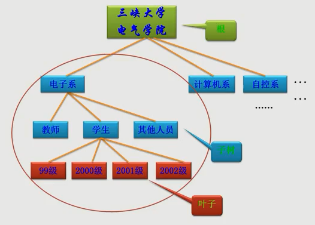

# 树的基本概念

树的定义：
有且仅有一个结点称为根(root),当 n>1 时，其余的结点分为m个互不相交的有限集合。每个集合本身又是棵树，被称作这个跟的子树。

树的结构特点：
* 非线性结构，有一个直接前驱，可能有多个后继   1：n
* 树的定义具有递归性，树中还有树
* 树可以为空，即结点个数为 0

术语：
* 根     ——     根结点，没有前驱
* 叶子    ——    即终端结点，没有后继
* 森林    ——    m 颗不相交的树的集合(例如：删除根结点后的 子树个数)
* 有序树    ——    结点各子树从左至右有序，不能互换(左为第一)
    * 多指 二叉树
* 无序树     ——    没有顺序，可互换位置
* 双亲    ——    直接前驱
* 祖先    ——    根到该结点所经分支的所有结点
* 孩子    ——    直接后继
* 子孙    ——    该结点下层子树的任一结点
* 兄弟    ——    同一双亲下的同层结点(孩子之间互称兄弟)
* 堂兄弟    ——    双亲位于同一层的结点

* 结点     ——    树的数据元素
* 结点的度    ——    结点挂接的子树数(有几个直接后继就是几度)
* 结点层次    ——    从根到该结点的层数(根结点算第一层)
* 终点结点    ——    即度为 0 的结点，即 叶子
* 分支节点    ——    除树根以外的结点(也称  内部结点)
* 树的度    ——    所有结点度中最大值(Max{各节点的度})
* 树的深度(或高度)    ——    指所有结点中最大的层数(Max{各结点的层次})

## 树的表示法

图形表示法：事物之间的逻辑关系可以通过树的形式很直观的表示出来

广义表示法

通过文字来表示出图的形式

同级关系用逗号隔开，亲子关系用括号 表示

左孩子右兄弟表示法
作用：将多叉树 转换为 二叉树

左边的孩子保留，右边如果有兄弟成为 右孩子
