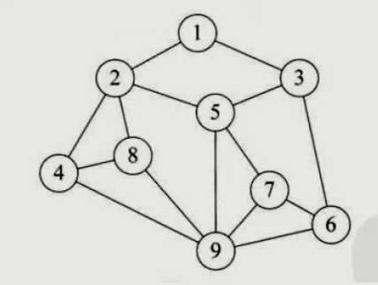
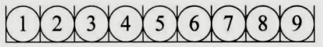
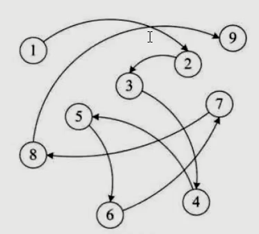

# 数据结构基本概念

## 算法特性
1. 输入     0个 或 多个
2. 输出     1个 或 多个
3. 有穷     不陷入死循环
4. 确定     每步算法目的明确
5. 可行     在相应语言上可以运行

## 数据结构分类

### 逻辑结构

1. 集合          无逻辑关系
2. 线性          1：1
3. 属性          1：n
4. 图形          n：n

#### 线性结构
概念：线性结构中的数据元素之间是 一对一的关系。

一对一 ： 一个前驱、一个后继

* 第一个元素 没有前驱
* 最后一个元素 没有后继
* 其他每个元素都有唯一的前驱 和 后继

应用 ：链表、数组

#### 树形结构
概念：树形结构是 数据元素之间存在一种一对多的层次关系

一对多 ：一个前驱、多个后继

* 第一个元素 没有前驱，有n个后继
* 最后的元素 没有后继
* 其他每个元素都有 n个后继和唯一的前驱

#### 图形结构
概念：图形结构的数据元素是 多对多的关系

多对多： n个前驱 、n个后继
前驱后继共用

如图：

---

### 物理结构

1. 顺序存储
2. 链式存储

#### 顺序存储结构
概念：把数据元素存放在地址连续的存储单元里，其数据的逻辑关系和物理关系是一致的。
如图：

应用：数组

#### 链式存储结构
概念：把数据元素存放在任意的存储单元里，这组存储单元可以是连续的，也可以是不连续的。
补充：数据元素的存储关系并不能反映其逻辑关系，因此需要用一个指针存放数据元素的地址，这样通过地址就可以找到相关数据的位置。

如图：

应用：链表

