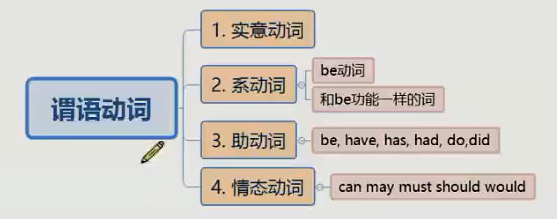
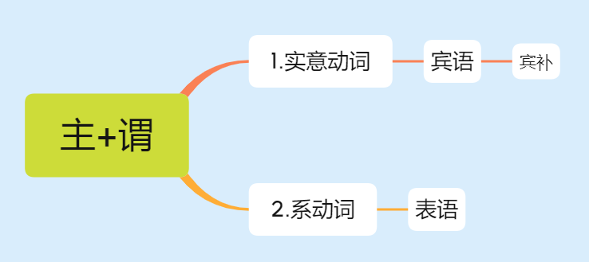
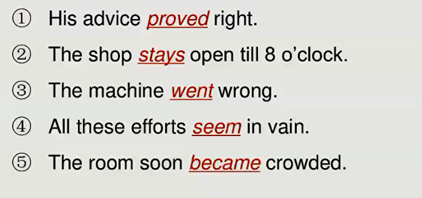
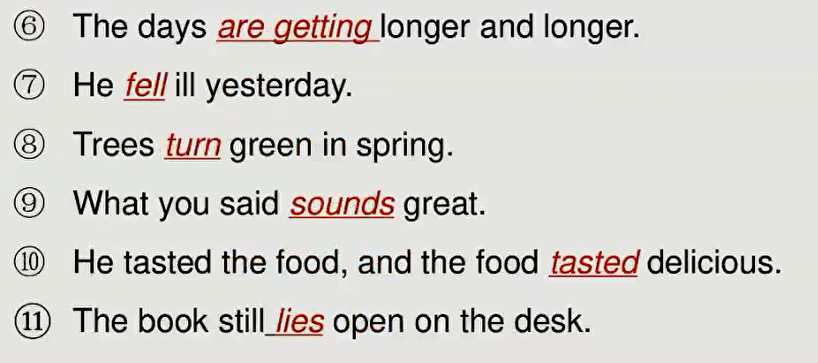
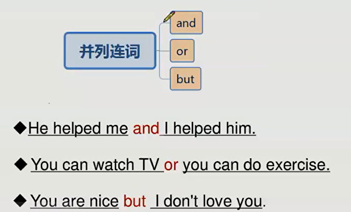
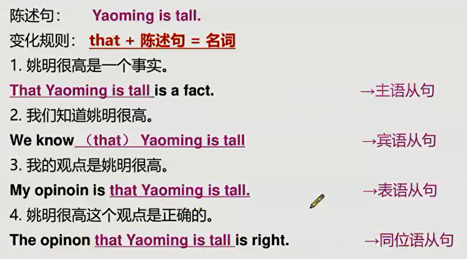
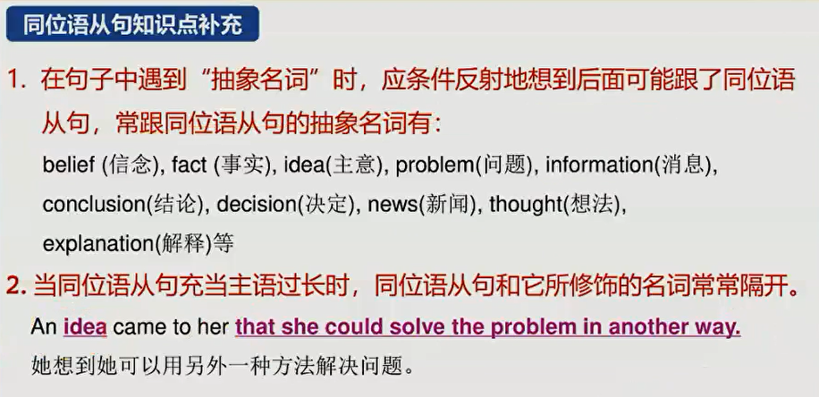

# 第一节课

## 主谓宾补表

### 主语

定义： 放在谓语动词之前的成分。

### 谓语
定义：谓语就是动词，主要分为 实意动词  和 系动词

实意动词：有实际意义的动词

系动词：就是be动词 以及 等同于 be动词的词
判断技巧：能替换成 be 动词

助动词：帮助动词 实现时态、语态

### 宾语
定义：放在实意动词之后的成分就叫宾语。

宾补：字面意思
判断技巧：宾语和宾语之后成分 加 be动词后 能构成一个逻辑完整的句子。

### 补语

### 表语
定义：放在系动词之后的成分就叫表语。

### 状语
定义：除去 五大基本概念 和 形容词(定语) 剩下的成分 就是状语。

- 副词都是状语

- 介词短语 == 状语
例句： We have worked for 5 days.       ----   for 5 days  是 介词短语  ===  状语    

## 基本句型
1. 主 + 谓
1. 主 + 谓 + 宾
1. 主 + 谓 + 宾 + 宾
1. 主 + 谓 + 宾 + 宾补
1. 主 + 系 + 表

结论：
1. 五大基本句型是 万句之源；
2. 一个句子的主干有且仅有一个谓语动词。    

### 主+谓

It is raining.    is 助动词，raining 实意动词。
                         is + raining  ==  助动词 + 实意动词  ==  动词
                         

### 主+谓+宾+宾补

介词和介词短语 可以做 宾补
例句：Let the fresh air in.          ----       air is in. 成立     in 作宾补

### 主+系+表

## 并列句
简单句 + 并列连词 + 简单句   

并列连词： and     or     but

##  三种从句

* 名词从句
* 形容词从句     （定语）
* 副词从句         （状语）

### 名词从句
定义：一个句子做了名词的功能
that + 陈述句 = 一个名词

名词从句 放在基本句型的不同成份上 演化为不同的从句

同位语从句：与成分放在同一个位置上的从句

#### 同位语补充

#### 把疑问句用作 陈述句从句

一般疑问：
变化规则：if/whether + 疑问句的陈述语序 = 名词

特殊疑问：
变化规则：陈述语序的特殊疑问句 = 名词

## 三种句型
1. 陈述句
2. 一般疑问句
3. 特殊疑问句

特征：谓 + 主

疑问句： 一般疑问句和特殊疑问句的区别 
    - 能用yes  或 no回答的 是 一般疑问句
    - 反之，是特殊疑问句
    

### 一般疑问句
    - 特征： 谓 + 主
    - 将动词提到前面
    - 例子：
    - 复合动词只需要提一个到前面： will come  or   can come
    -  将情态动词 或 助动词 提到前面即可
    

### 特殊疑问句

- 特征：在一般疑问的基础上 ，wh..  、how 开头的问句
- 

