# 第三节课

## 副词
定义：修饰动词、形容词和整个句子的可有可无的成分。

小结：副词就是状语，状语就是副词。
除去五大基本句型和定语，就是 副词、即状语

## 副词从句
完整句子 + 连接词 + 完整句子

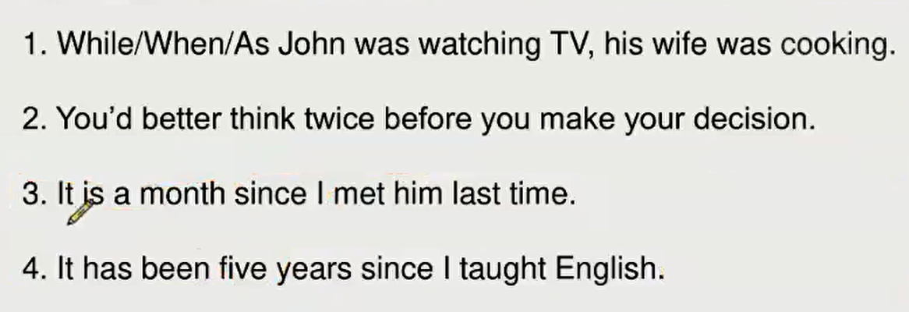

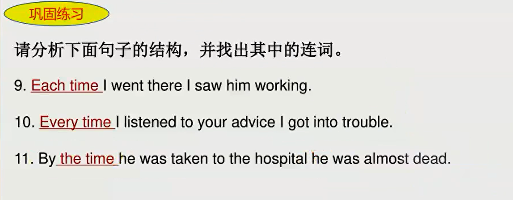

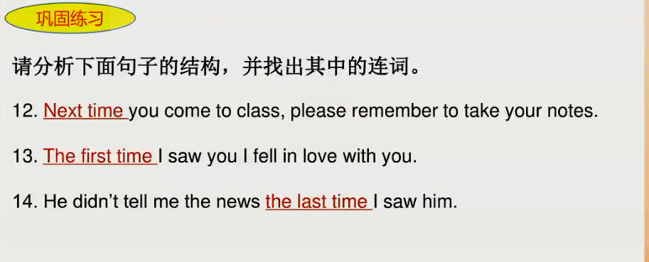

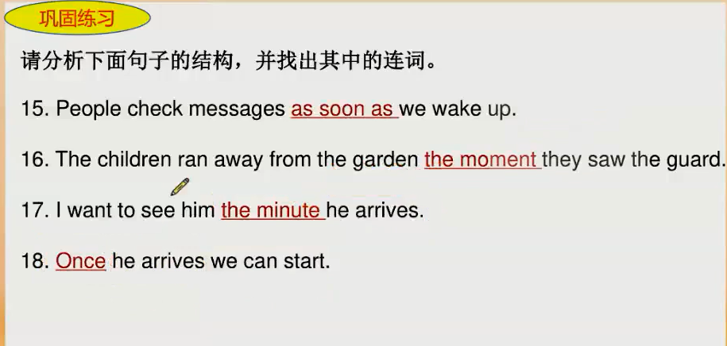

一.... 就 .....
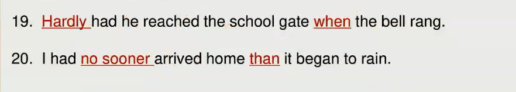    

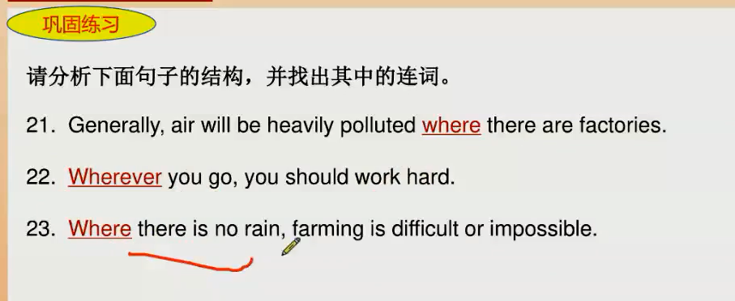
  
Now that 既然
in that      因为

from 远离  
  
  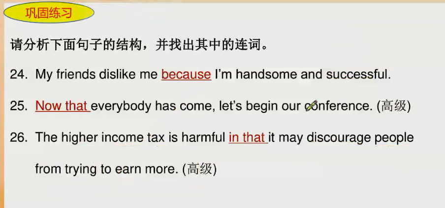
  

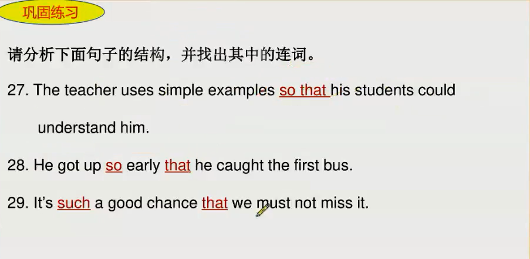

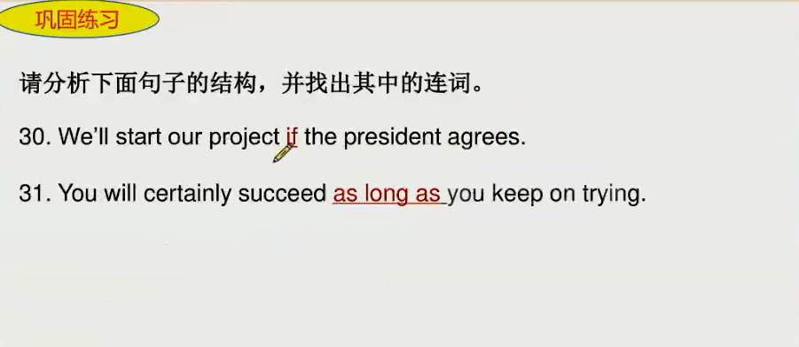

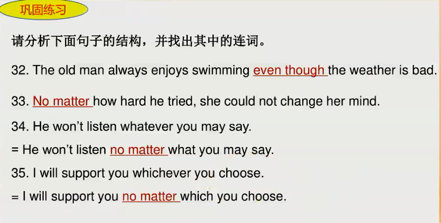

on  连续、连接的状态

off  断开、断离的状态
I have a day off;
take off                飞机起飞/脱衣服
I get off the car;    

by    挨着靠着、通过、到...为止(加时间点)
I sit by the side;
I have table by the window.

## 连词总结

小结：
1. 简单时间状语连词
when/while/as/before/after/since/till/until/
2. "一... 就... " 系列
as soon as/(the moment/minute/second)/once/hardly...when/no sooner... than/
3. Time系列
every time/each time/next time/the last time/the first time/by the time

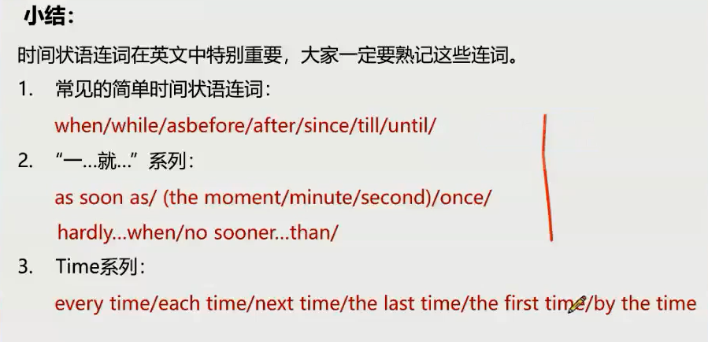

## 长难句必杀技一 —— 左二右六原则
1. 已经存在的形容词放在名词前面
2. 人为创造的形容词放在名词后面

左：
1. 限定词
2. 形容词

右：
1. 不定式    -     todo
2. 分词    -    done   doing
3. 介词短语
4. 定语从句
5. 形容词短语
    1. beautiful 形容词
    2. beautiful enough 形容词短语
6. 同位语从句

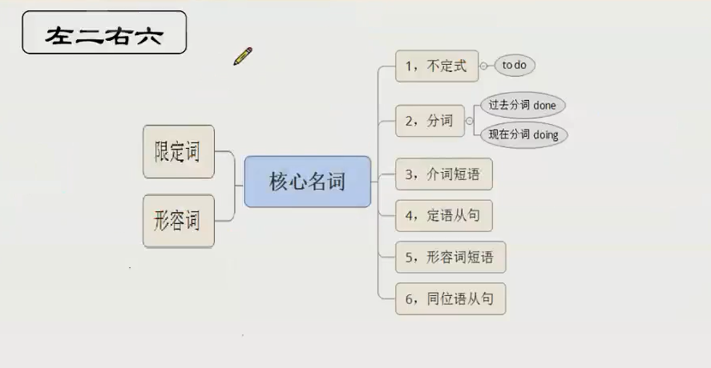

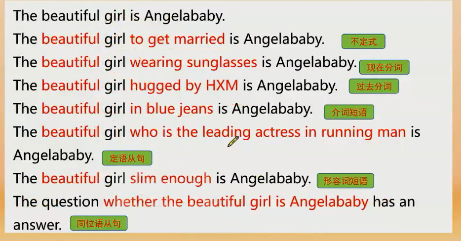

### 动名词、现在分词
本质：doing sth.

动名词：doing sth. 做名词
现在分词：doing sth. 做形容词

