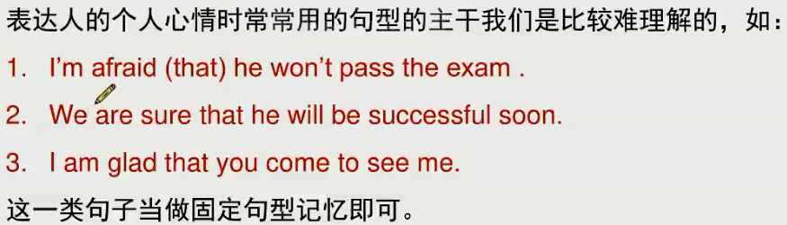
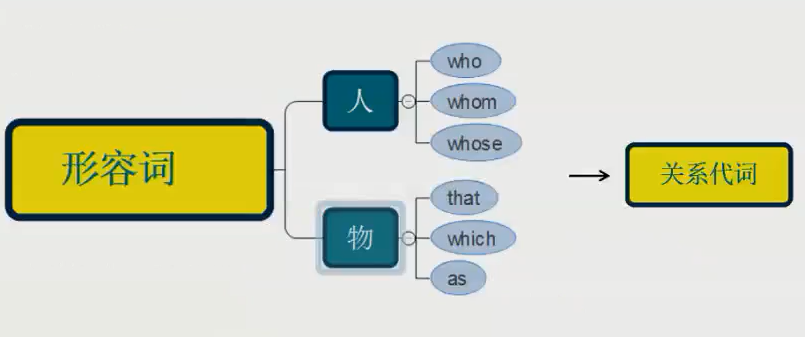
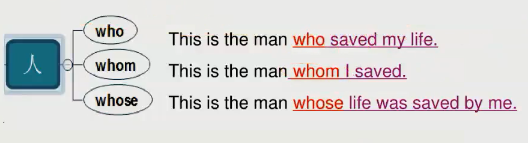
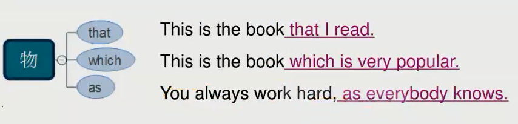
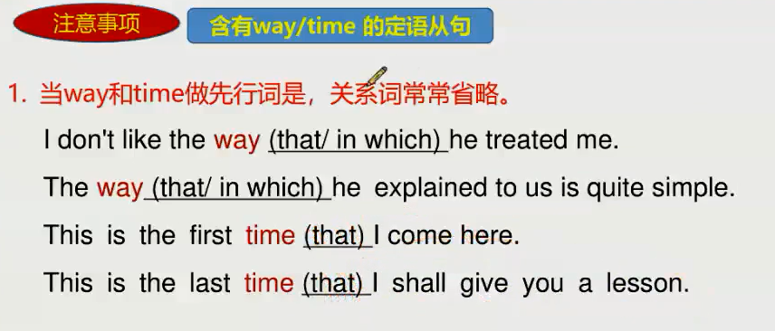
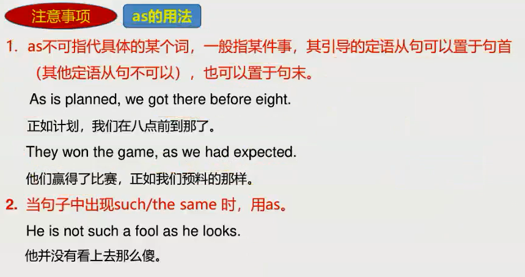
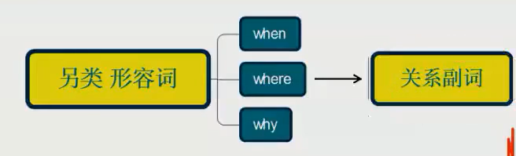
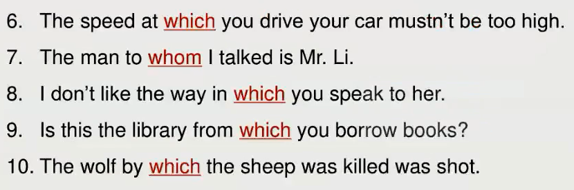
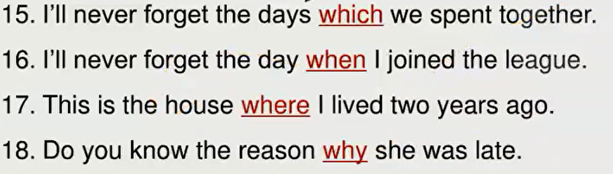

# 第二节课

## 8 个特殊疑问词

- 组1：
1. what
2. which
3. who
4. whose
- 组2：
1. when
2. where
3. why 
- 组3：
4. how

注意事项：
主系表中： 表达个人心情的常用句型 是特殊情况
这个情况下，主系表 + 名词从句

---

## 形容词性从句 (定语)
定义：一个句子做了形容词的功能。

连接词 作宾语可以省略。

### 形容词修饰对象
人、物

---

---

### 护士三姐妹

who      ——    连接词表主动
whom   ——    连接词表被动
whose   ——    连接词后词表主动

---

---

that        ——   连接词表被动
which     ——   连接词表主动，+ 介词表被动
as           ——   连接整个句子，翻译有 正如 的意思

---

---
#### 可以省略的情况

way 和 time 做先行词的定语，关系词常省略。
原因：左右都是完整的句子，做状语成分，可有可无，可以省略

### 形容词性从句规律

#### as 的用法

1. as 不可指代具体某个词，一般指某件事，引导的定语从句可 置于句首(其他定语从句不可以), 也可以置于句末。
2. 当句子中出现 such/the same 时，用as

1. 正如         分句，在句首
2. 因为         分句
3. such as    句内

遇到such  +   as   ——  as 指代前面的词

看例句：

#### to    介词的用法
介词 +  名词  构成     介词短语    90%以上做 状语

1. to do      动词不定式短语
2. to + n.    介词短语

#### that
形容词性从句中   不和 逗号、介词搭配

出现逗号、介词的时候 ，都填 which

#### 句子加逗号
I like the girl who is beautiful.    // 我喜欢这个漂亮的女孩。
I like the girl, who is beautiful.   // 我喜欢这个女孩，因为她很漂亮。

结论：加逗号时，要翻译成两个句子，根据语境 逗号会有 因为 的意思 。

### 三个另类形容词
1. when
2. where
3. why
后面跟着的 是完整的句子。

when     ——     前面加 时间
where    ——     前面加 地点
why       ——     前边加 reason ，就这一个单词

--------在句中做关系副词， 副词 == 状语 均是句中 可有可无的部分

---

---

### 动名词
本质：动作 + 名词 == 名词
doing sth  ==    名词

### 形容词性从句例句

#### such   as

