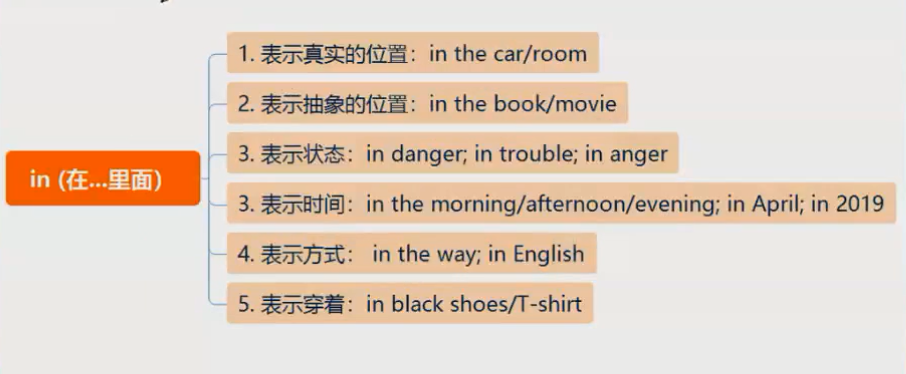
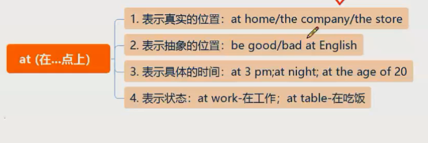
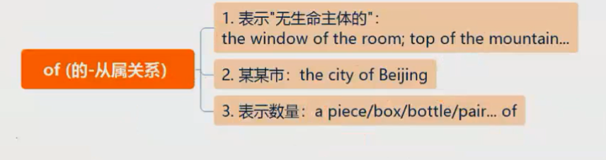
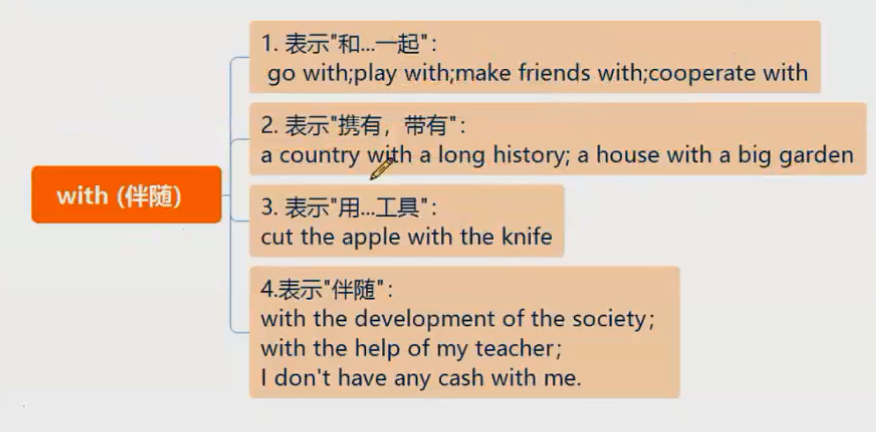
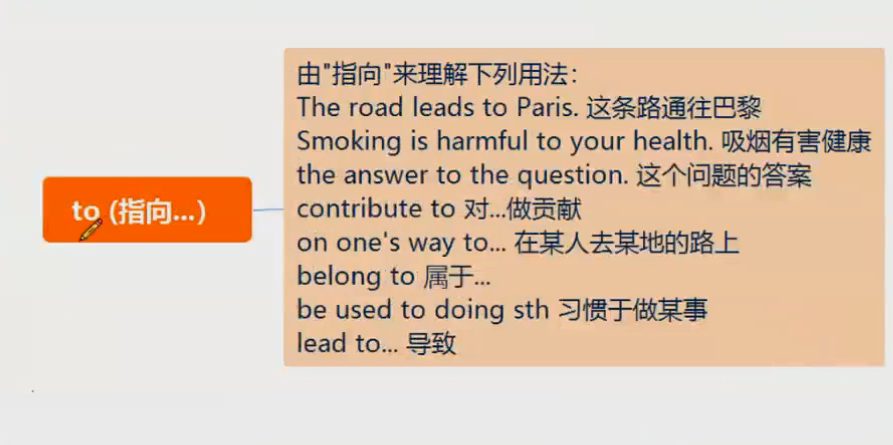
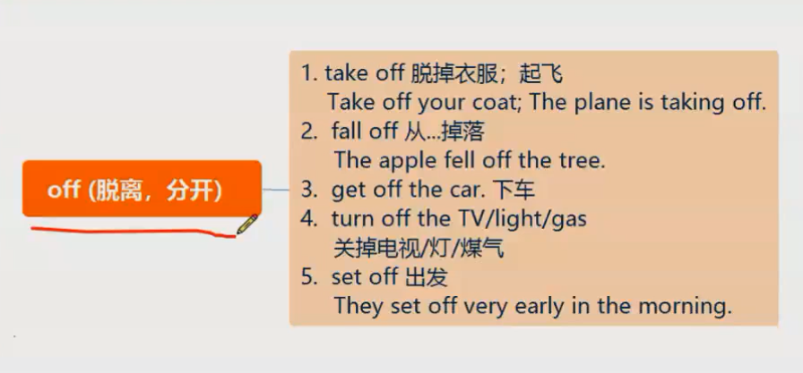
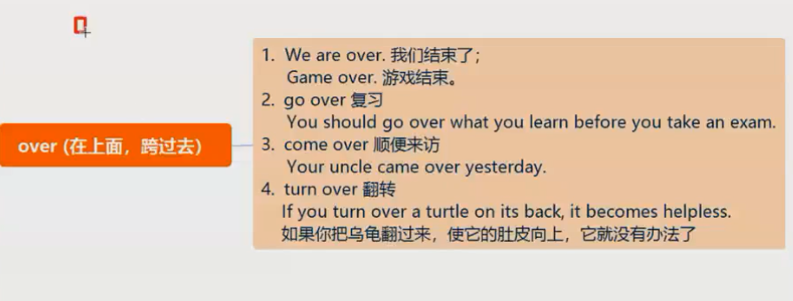
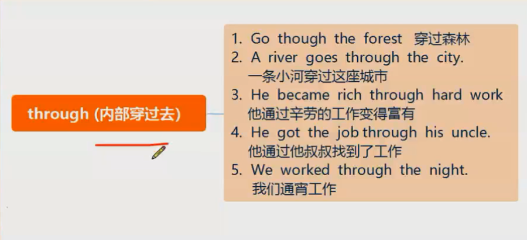
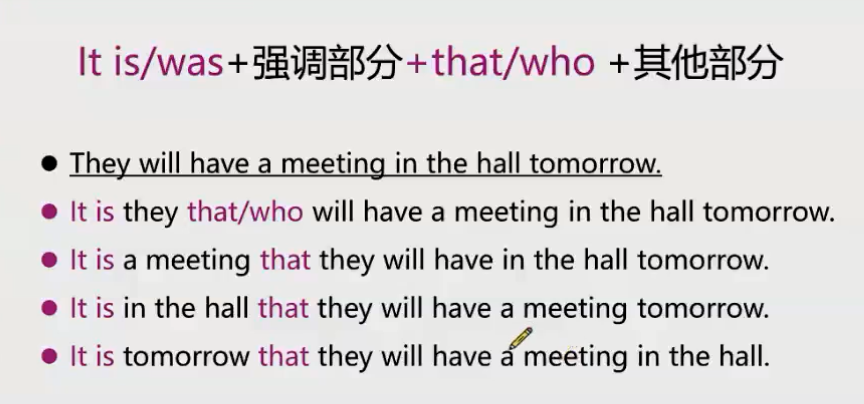

# 第五节课

## 15 个常见介词

in/ on/ at/ of / for/ by/ with/ from/ to/ as/ about/ around/ off/ through/ over

分类：
单词分为两个维度：自然存在/ 精神抽象

in
大

on
小、持续、紧连

at 
点

of
无生命

for
为了、因为、时间、对某人而言、支持

by
时间截止、在... 附近
 

with
伴随

from
远离

to
指向

to doing 
to 是个介词
to + doing sth.  动名词

about 
在... 附近

off
脱离、分开
away, divide

over
在上面、跨过去

as
作为

through
内部穿过

## 四大特殊句型

1. 强调句
2. 倒装句
3. 虚拟语气
4. 独立主格

### 强调句

