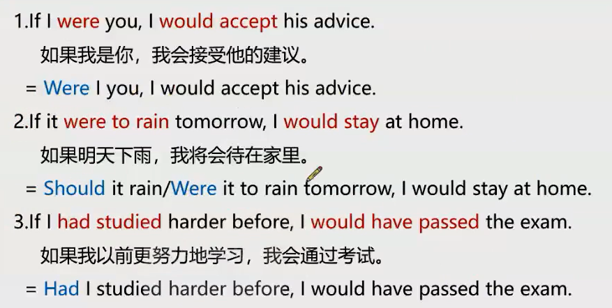

# 第六节课

## 倒装句 —— 用作强调
1. 完全倒装     ——     全部谓语放在前面
    - 谓语动词 + 主语
2. [部分倒装](###部分倒装)    ——     部分谓语放在前面
    - 助动词/情态动词 + 主语 + 动词
    
### 完全倒装

there be 、分词、介词、形容词前置

情况：
1. [there be 句型](####1、2)
2. [分词前置](####1、2)
3. [介词或介词短语前置](####3、4)
4. [形容词短语前置](####3、4)

    

---

#### 1、2

---
#### 3、4
介词或者介词短语
用代词表示主语时，只把介词提到前面，谓语语序正常

---

### 部分倒装
否定词前置，置前情态动词

### 虚拟语气
三种虚拟
1. 过去    ——     过去的过去 if... had done... would have done...
2. 现在
3. 将来

注意点：所有虚拟语气的 be 动词，只有 were

#### 虚拟语气去掉 if 表达

去掉if 
将 主语后 一个谓语 提到前面

It rained cats and dogs this morning.

带有强烈情感 或 命令的 动词之后的 宾语从句用虚拟语气

### 独立主格
主语 + doing/ done

## 英语时态
两个侧重点
1. 时间
2. 状态

1. 一般现在时(do/ be)     ——     侧重时间

### 完成时 侧重状态

have 强调状态

have + done  现在完成时，表示过去到现在的时间点 完成的事

have + been + dong  现在完成进行时，表示过去到现在的时间点 完成的事，并且这个时间段内，一直持续在做这件事

### 过去将来时
would do 
would be doing 过去将来时
would be doing  想象
would have done
would have been doing

