# 第四节课

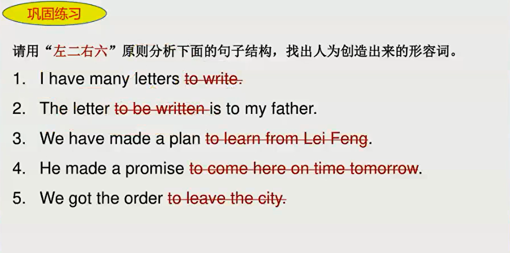

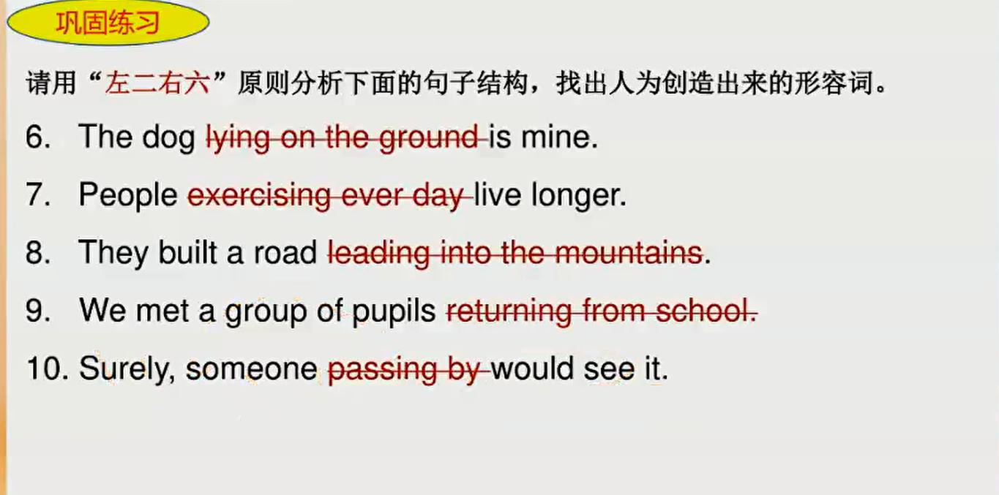

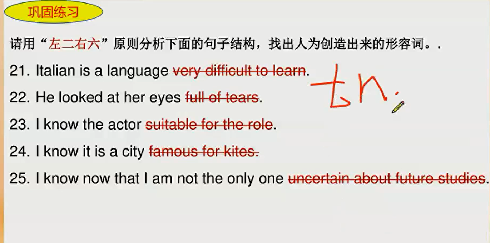

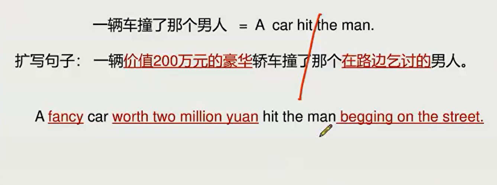

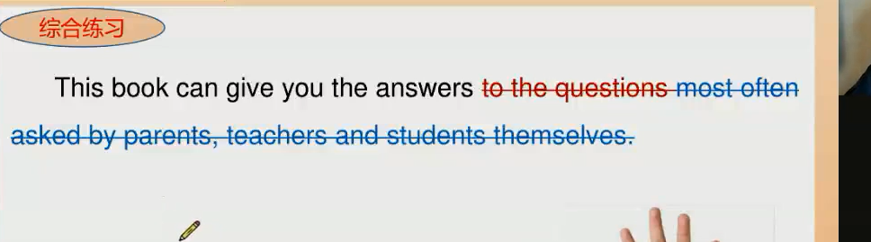
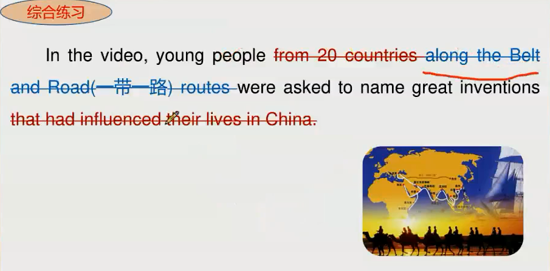

## 长难句秒杀二 —— 悬挂结构
名词
形容词
动词

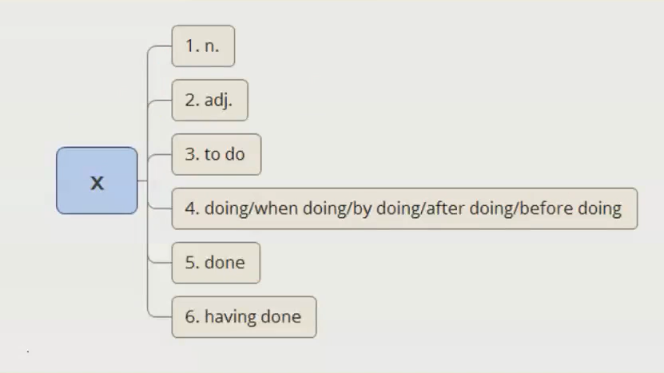

### 名词
就近解释

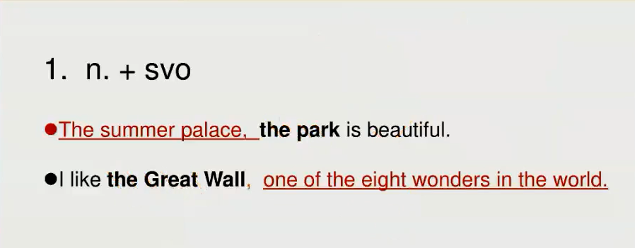

### 形容词
和主句的主语相连

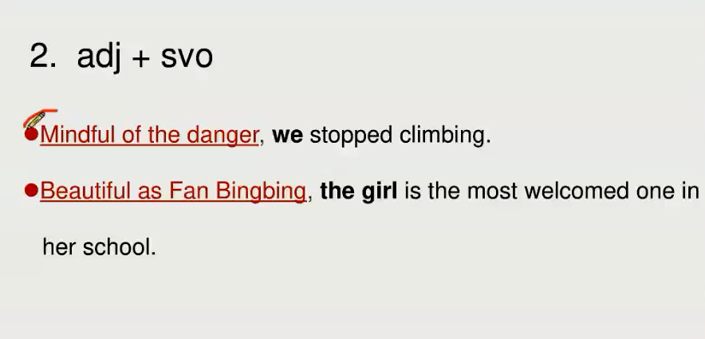

### 动词

#### to do
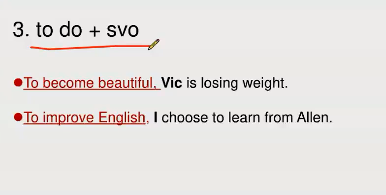

#### doing

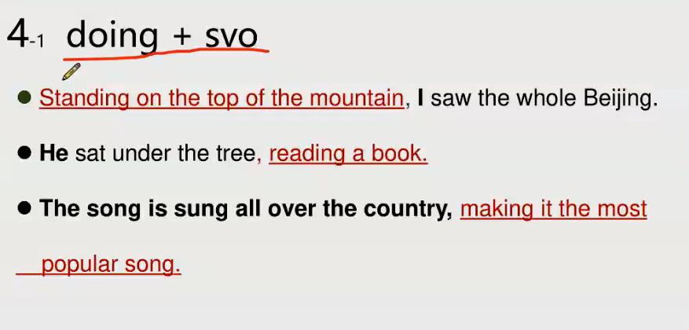

#### when doing

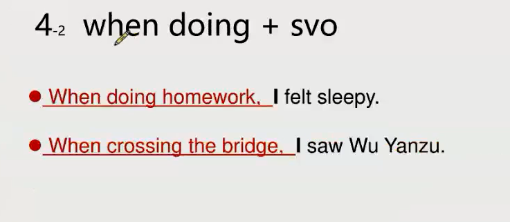

#### by doing

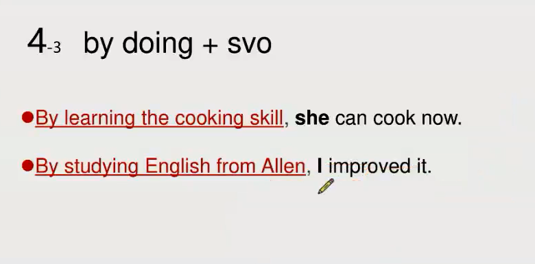

#### done

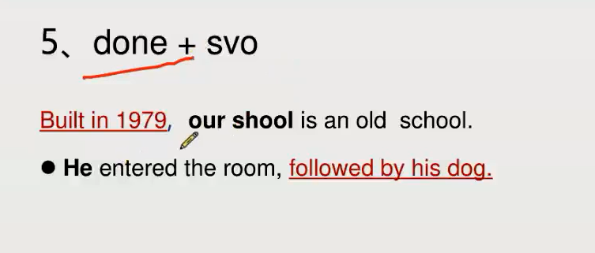

### Having done

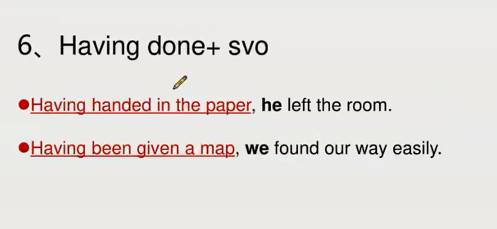

## 练习

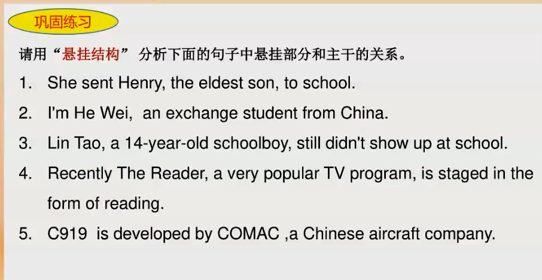

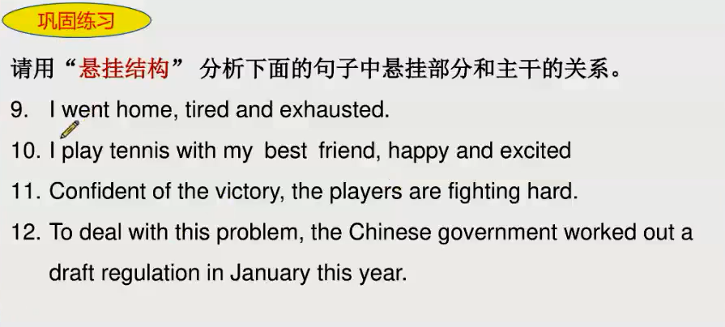

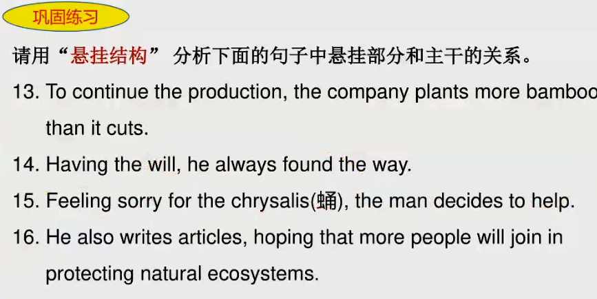

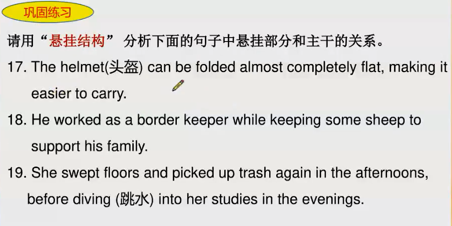

